# Práctica 6. Almacenamiento, tecnología iSCSI

## Objetivos de la práctica:

- Agregar puerto **VMkernel** para el Storage en Host **ESXI_01**.
- Agregar puerto **VMkernel** para el Storage en Host **ESXI_02**.
- Agregar controladora **iSCSI** basada en software en **Host ESXI_01**.
- Descubrir las **LUNs** desde el **Host ESXI_01**.
- Agregar controladora **iSCSI** basada en software en Host **ESXI_02**.
- Descubrir las **LUNs** desde el **Host ESXI_02**.

## Duración aproximada:
- 20 minutos.

> Revisión 1.1 2024

## Instrucciones

### Actividad 1. Agregar puerto VMkernel para el Storage en Host ESXI_01

Utilizar en su sistema la herramienta de “**Conexión a escritorio
remoto**” con la dirección y puerto que le proporcionará su instructor;
utilizar como:

> Usuario: `vclass\Administrator`
>
> Contraseña:  `VMware1!`

Abrir una instancia de Firefox, seleccionar el acceso rápido de
**vCenter**.

Con el propósito de alcanzar por la red el arreglo de discos en donde
contamos con unidades de almacenamiento **LUNs**, es necesario
establecer una red con un puerto **VMkernel** en cada host para esta
tarea.

Iniciar con el Host **ESXi_01** y realizar una configuración
similar en el Host **ESXI-02**.

Seleccionar el host **ESXi_01** (1). Dar click en pestaña **Configure** (2)
en la sección de **Networking**, click en **Virtual switches** (3).
Expandir el **vSwitch0** (4), click en **ADD NETWORKING** (5).

 

Click en **VMkernel** Network Adapter (2), click en **NEXT** (3).

 

Seleccionar: **Select an existing standard switch** (2), click en
**vSwitch0** (3), click en **NEXT** (4).

 

En el paso de propiedades del puerto determinar **IP Storage** como
Nombre de la red (2), click **NEXT** (3).

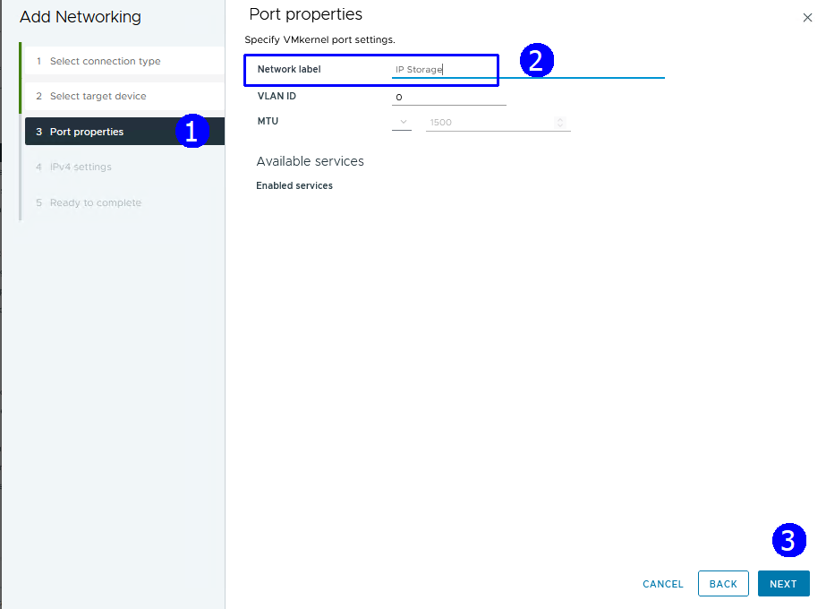

 

Establecer la dirección estática (2) con IP **172.20.10.61** y máscara de
red **255.255.255.0**. En la dirección IP del puerto **VMkernel** (3),
click **NEXT** (4).

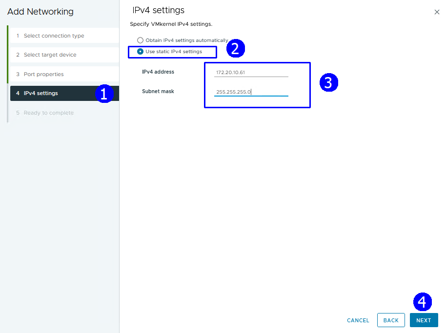

 

Revisar la configuración del elemento de red click en **FINISH** (1).

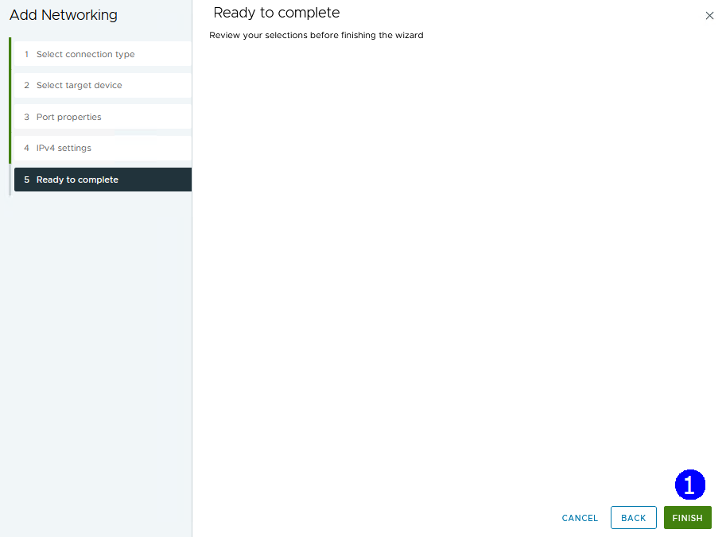

 

Observar la configuración del puerto **VMkernel IP Storage** con la
**vmnic0**.

 
 

### Actividad 2. Agregar puerto VMkernel para el Storage en Host ESXI_02

Para establecer una configuración similar de red en el Host **ESXi-02**.

Seleccionar el host **ESXi_02** (1). Dar click en pestaña **Configure** (2)
en la sección de **Networking**, click en **Virtual switches** (3).
Expandir el **vSwitch0** (4), click en **ADD NETWORKING** (5).

 

Click en **VMkernel Network Adapter** (2), click en **NEXT** (3).

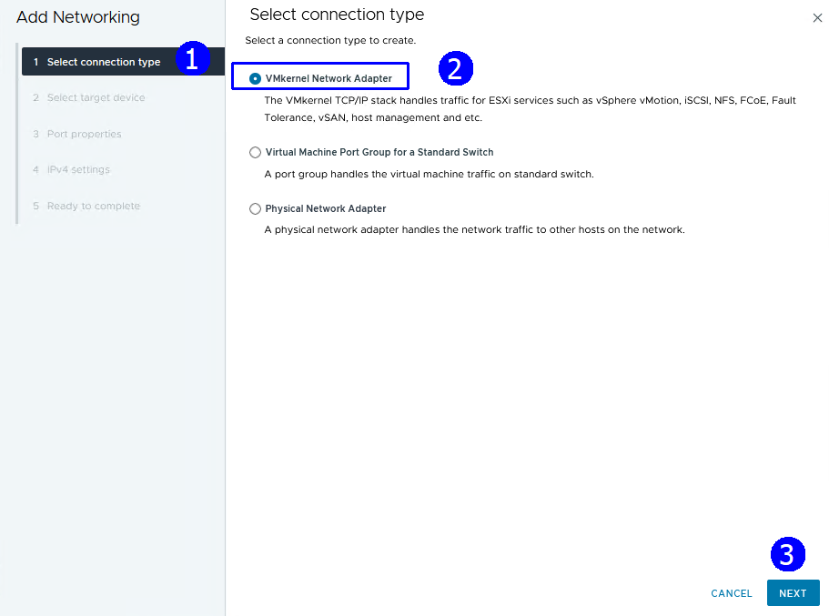

 

Seleccionar: **Select an existing standard switch** (2), click en
**vSwitch0** (3), click en **NEXT** (4).

 

En el paso de Propiedades del puerto, determinar **IP Storage** como
Nombre de la red (2), click **NEXT** (3).

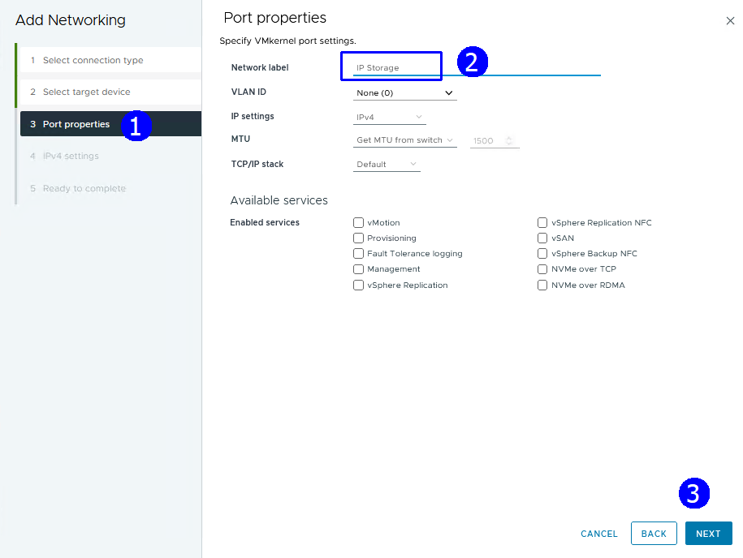

 

Establecer la dirección estática (2) con IP **172.20.10.62** y máscara de
red **255.255.255.0** en la dirección IP del puerto **VMkernel** (3),
click **NEXT** (4).

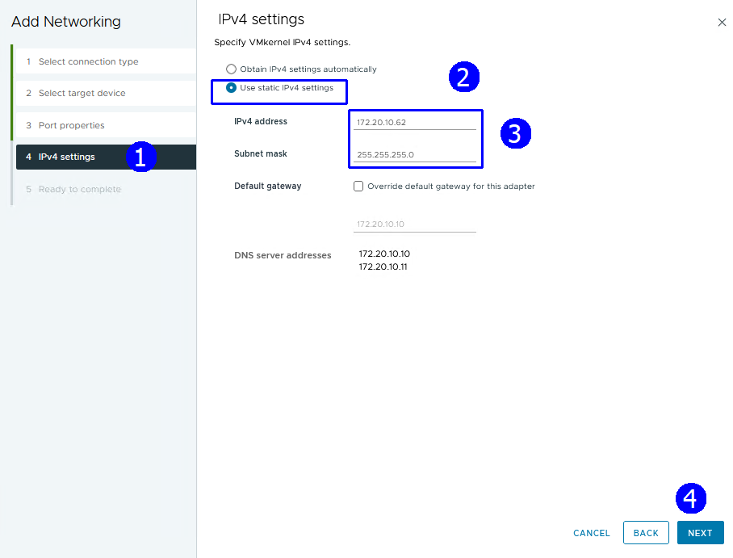

 

Revisar la configuración del elemento de red click en **FINISH** (1).

 

Observar la configuración del puerto **VMkernel IP Storage** con la
**vmnic0**.

 
 

### Actividad 3. Agregar controladora iSCSI basada en software en Host ESXI_01

Configurar una controladora **iSCSI** en el host **ESXi-01**. Dar click en
el **host** (1), click en la pestaña **Configure** (2) en la sección de
**Storage**, click en **Storage Adapters** (3). Dar click en **ADD SOFTWARE
ADAPTER** (4), click en **Add iSCSI Adapter** (5).

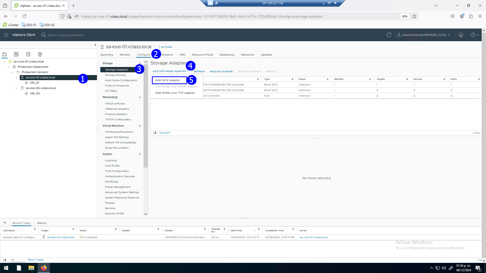

 

Se despliega el comentario siguiente **OK** (1).

 

Verificar el status **ENABLE** (5) y el **iSCSI Name** (6), para esto
click en el **host**, click en pestaña **Configure** (2), click en
**Storage adapter**, click en la tarjeta controladora **iSCSI** basada
en Software (4), click en la pestaña **Properties** (5).

 
 

## Actividad 4. Descubrir las LUNs desde el Host ESXI_01

Determinar **Dynamic Discovery** (5), click en **ADD** (6).

 

Establecer la dirección IP del Arreglo de disco **172.20.10.15** (1) con
número de puerto **3260** (2), click **OK** (3).

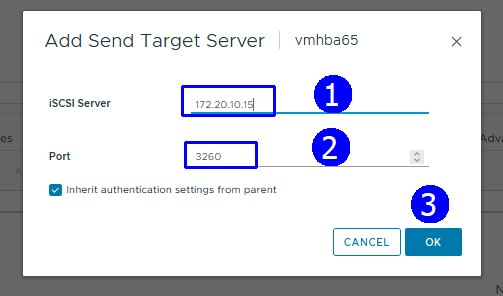

 

Realizar asociación de puerto de red, click en **Network Port Binding**
(2), click **ADD** (3).

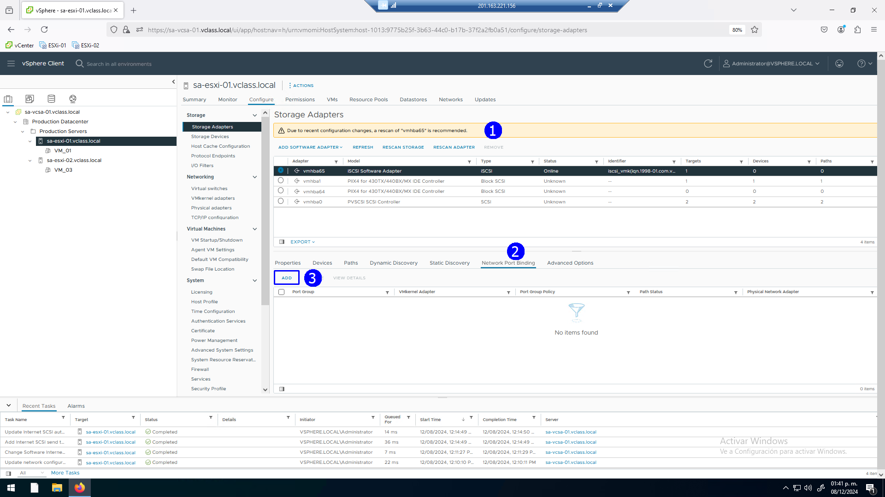

 

Click en el puerto **VMkernel IP Storage** (1), **OK** (2).

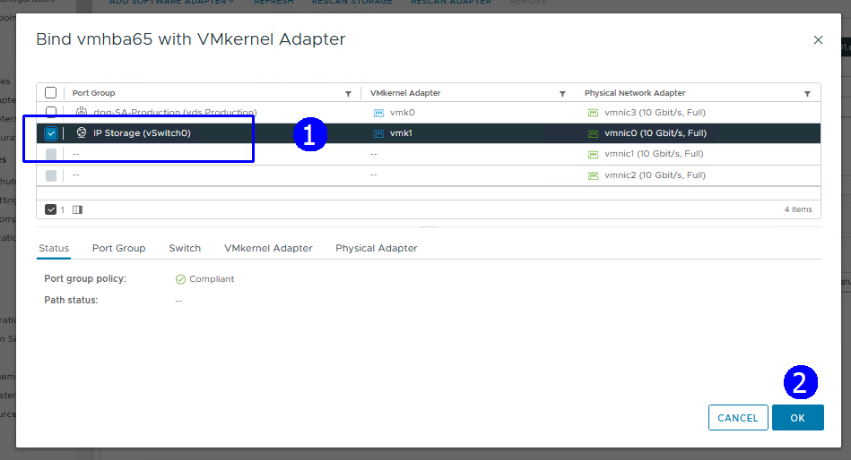

 

Es necesario para descubrir las trayectorias, dar click en **RESCAN
ADAPTER** (1).

Revisar las trayectorias de las **LUNS** descubiertas.

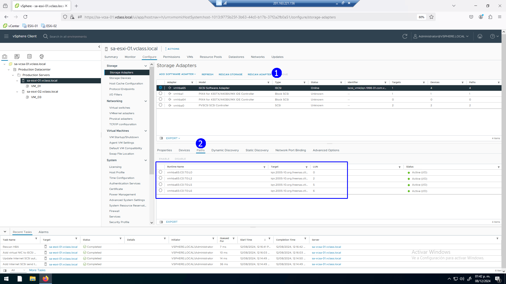

 

Revisar las trayectorias de las **LUNS** descubiertas click en
**Devices**.

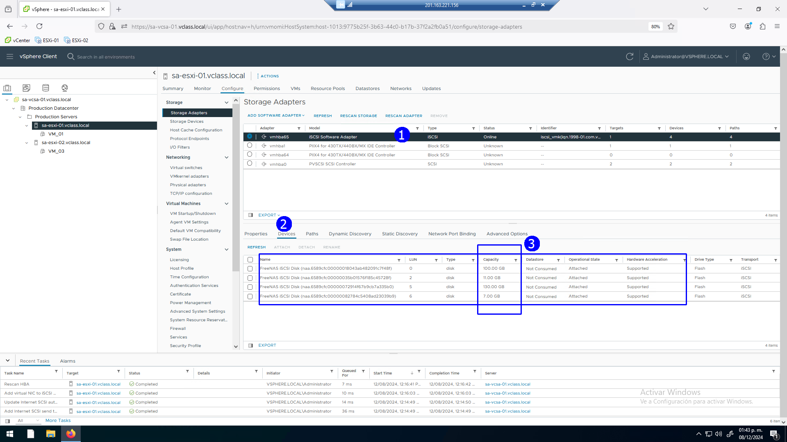**  
**

 
 

### Actividad 5. Agregar controladora iSCSI basada en software en Host ESXI_02

Es necesario en el Host **ESXI_02**, repetir las operaciones de adaptador
de Storage para ver también las **LUNs**.

Configuremos una controladora **iSCSI** en el host **ESXi-02**, click en
el **host** (1), click en la pestaña **Configure** (2) en la sección de
**Storage**, click en **Storage Adapters** (3). Click en **ADD SOFTWARE
ADAPTER** (4), click en **Add iSCSI Adapter** (5).

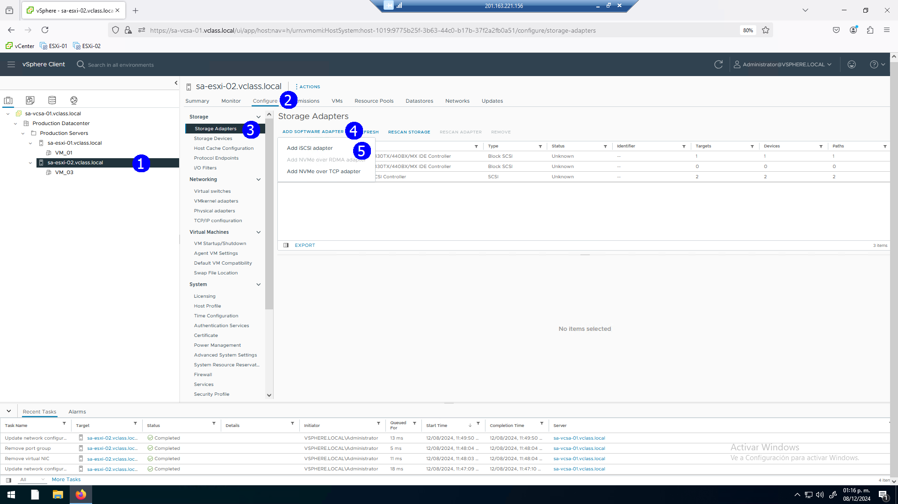

 

Se despliega el comentario siguiente **OK** (1).

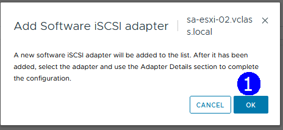

 

Verificar el status **ENABLE** (5) y el **iSCSI Name** (6), para esto
click en el **host**. Dar click en pestaña **Configure** (2), click en
**Storage adapter**, click en la tarjeta controladora **iSCSI** basada
en Software (4), click en la pestaña **Properties** (5).

 
 

### Actividad 6. Descubrir las LUNs desde el Host ESXI_02

**Determinar Dynamic Discovery** (5), click en **ADD** (6).

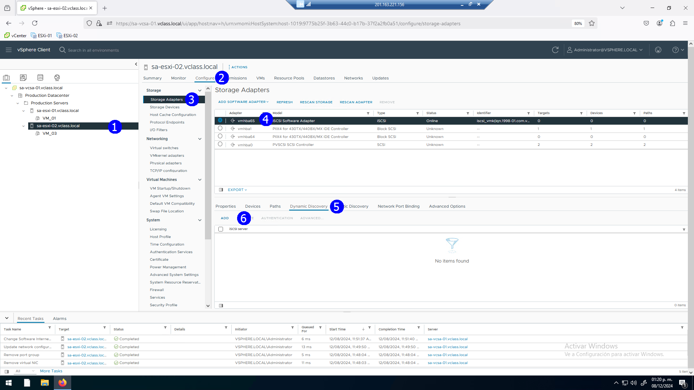

 

Establecer la dirección IP del Arreglo de disco **172.20.10.15** (1) con
número de puerto **3260** (2), click **OK** (3).

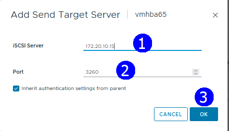

 

Realizar asociación de puerto de red, click en **Network Port Binding**
(2), click **ADD** (3).

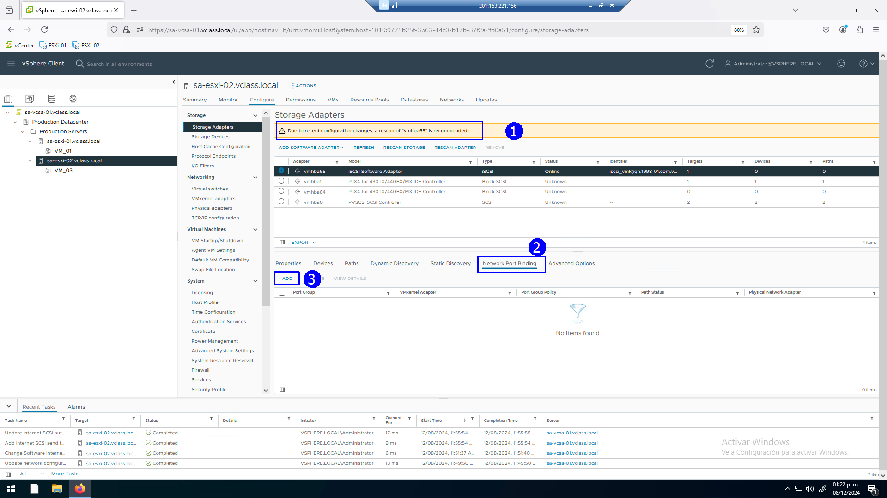

 

Click en el puerto **VMkernel IP Storage** (1), **OK** (2).

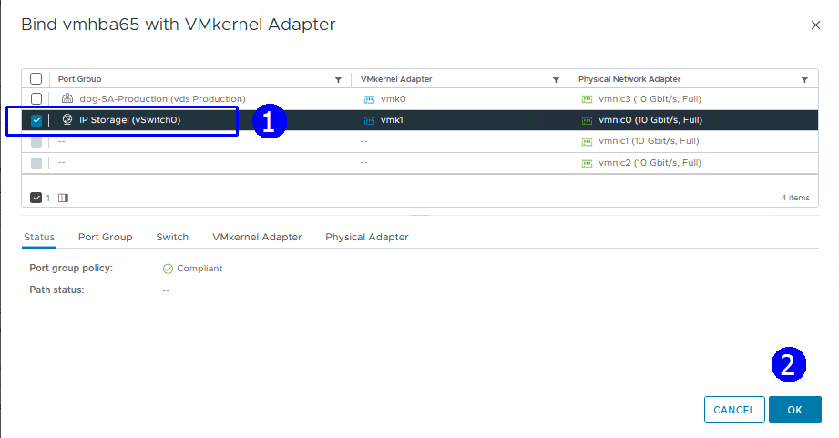

 

Es necesario para descubrir las trayectorias, dar click en **RESCAN
ADAPTER** (1).

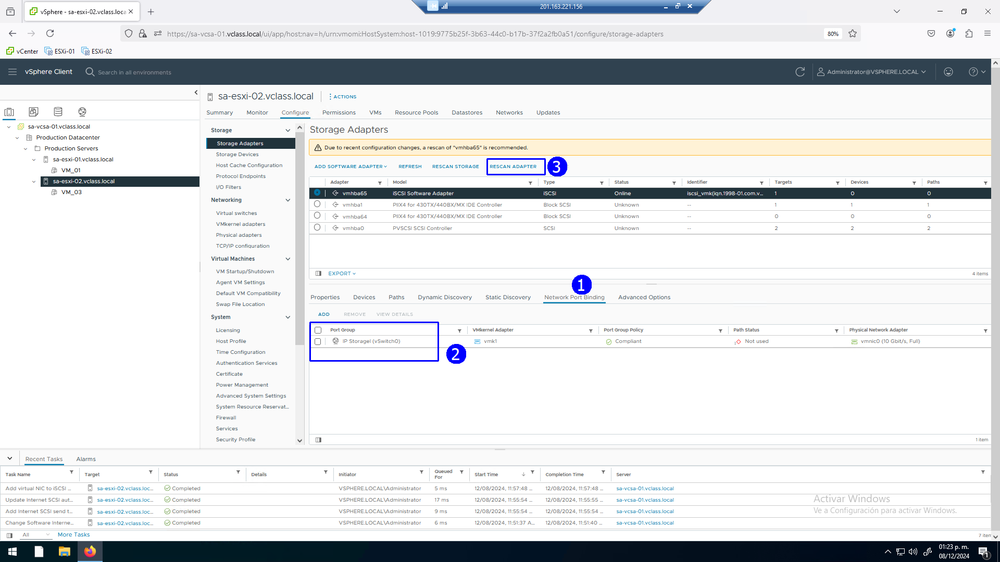

 

Revisar las trayectorias de las **LUNS** descubiertas.

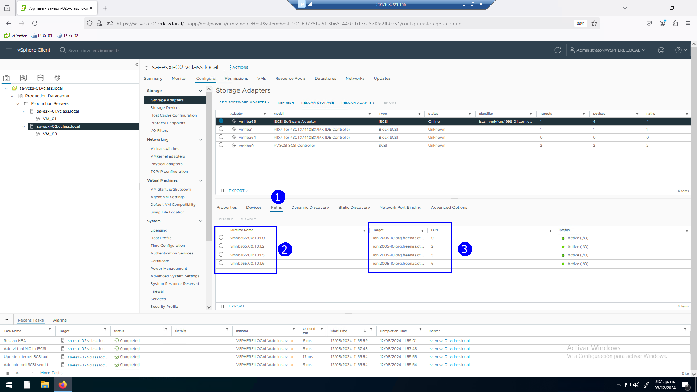

 

Examinar las capacidades de cada **LUN** (3) click en **Devices** (2).

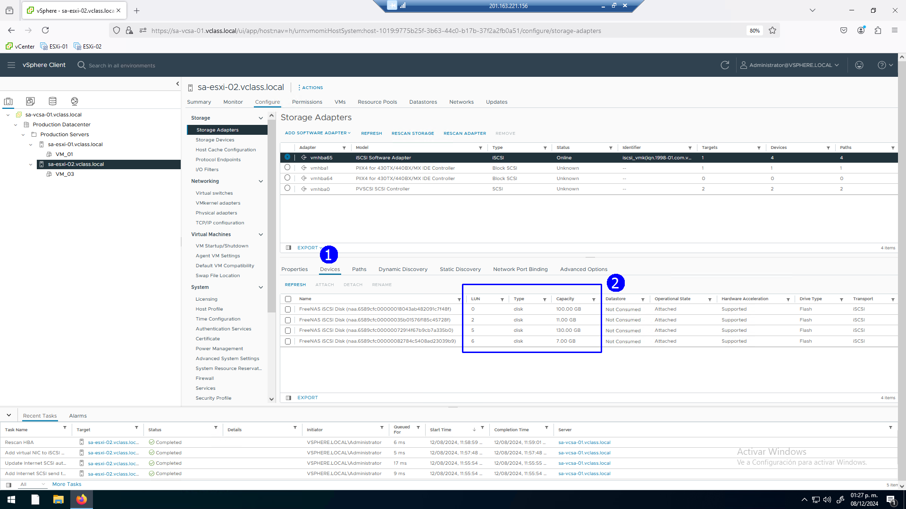
