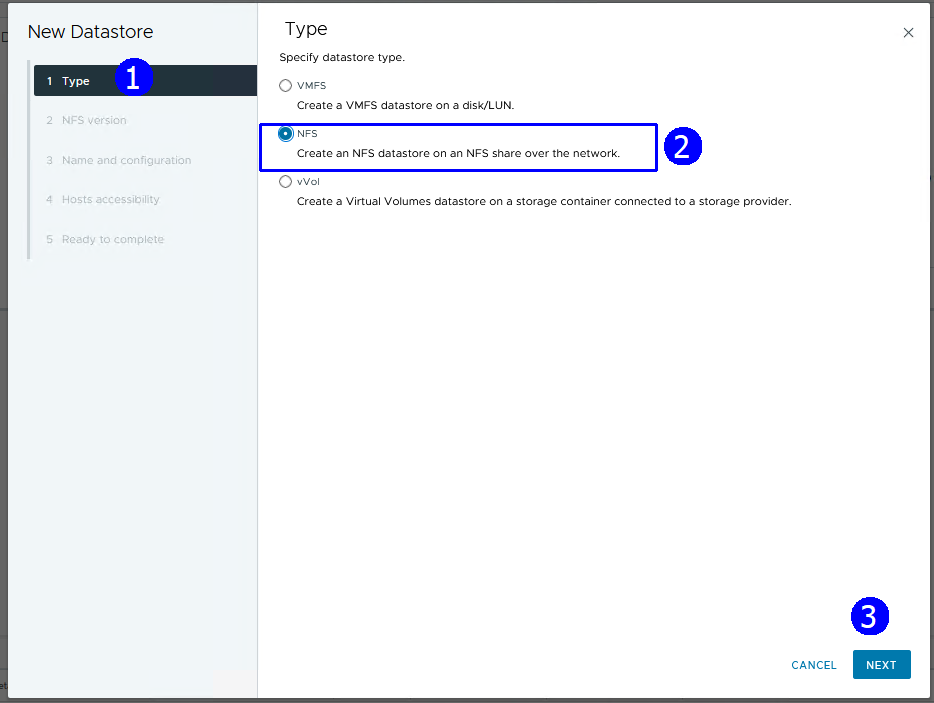
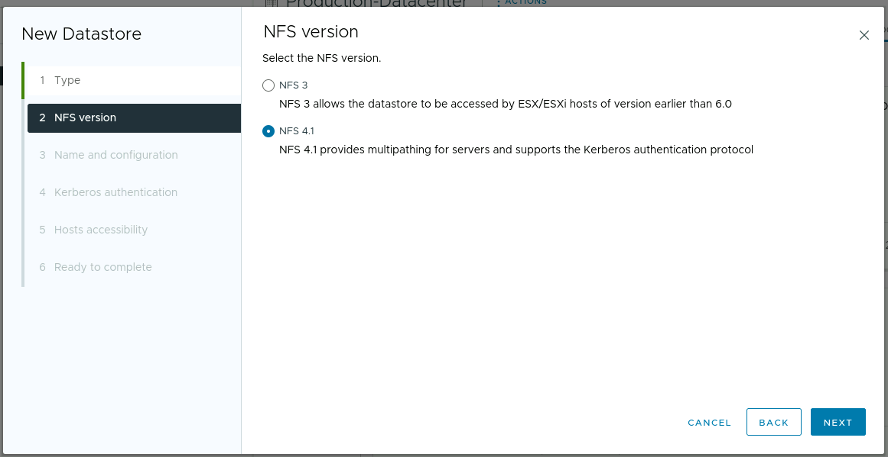
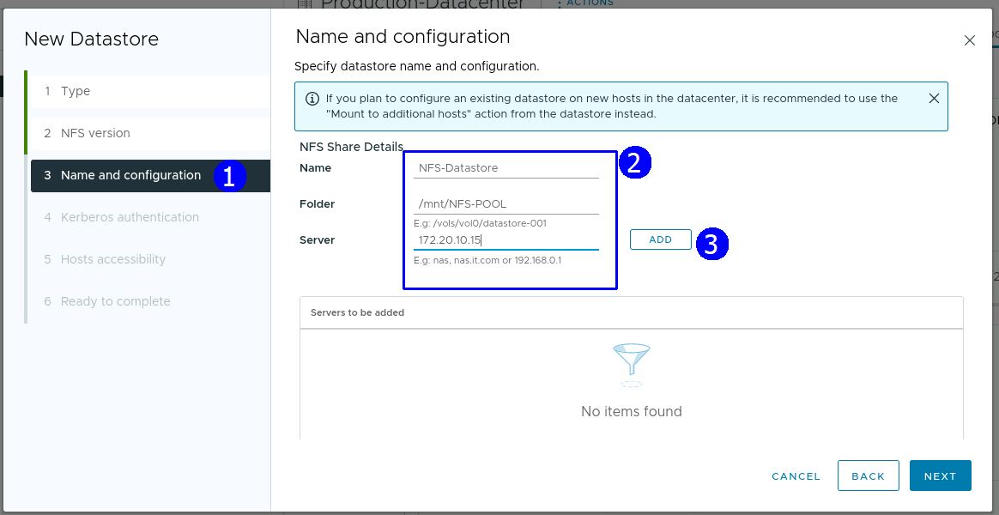
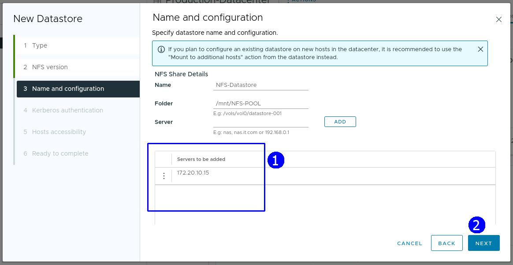
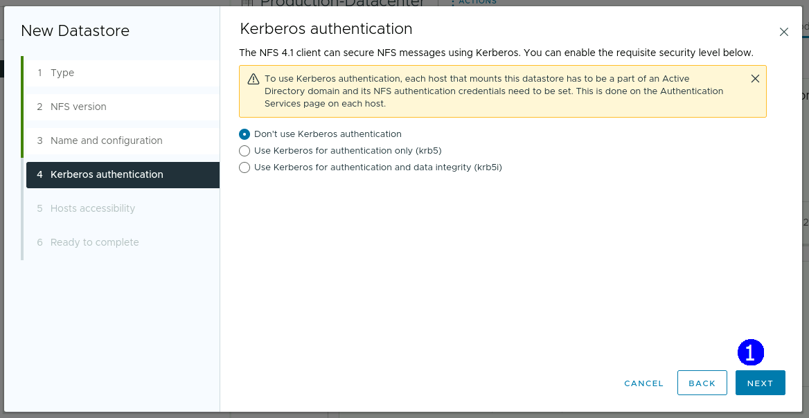
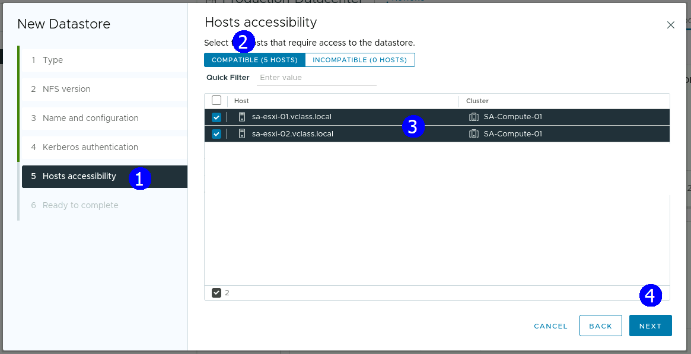
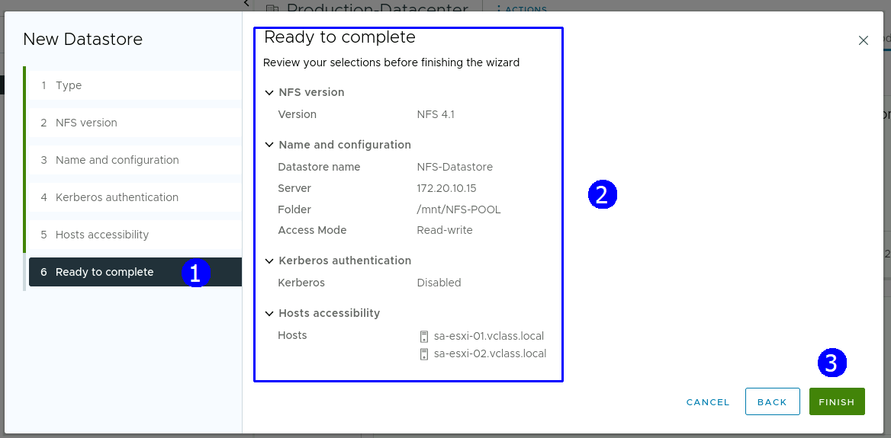
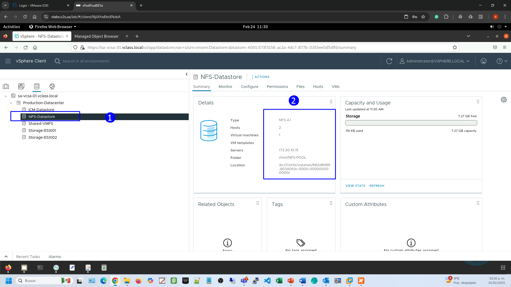
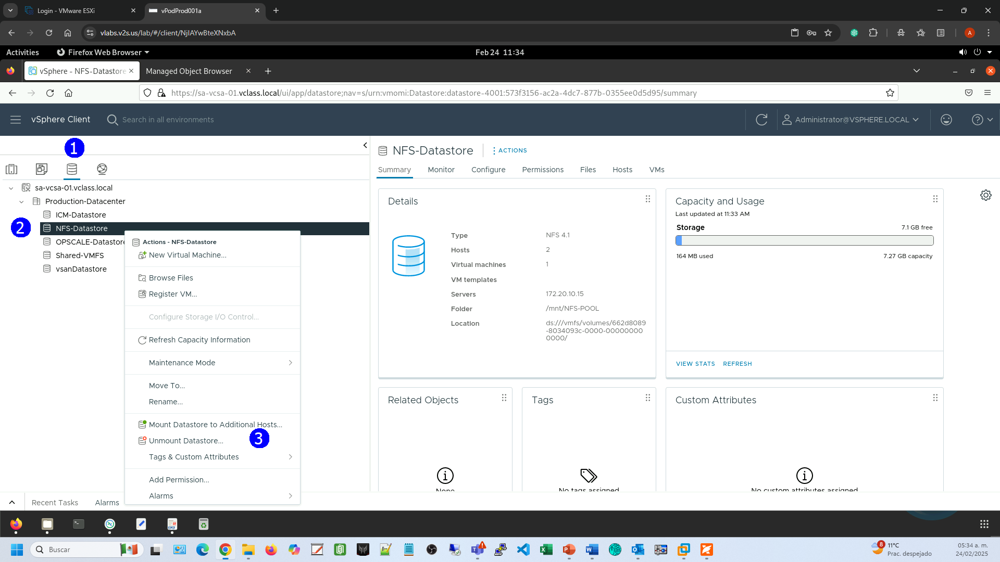
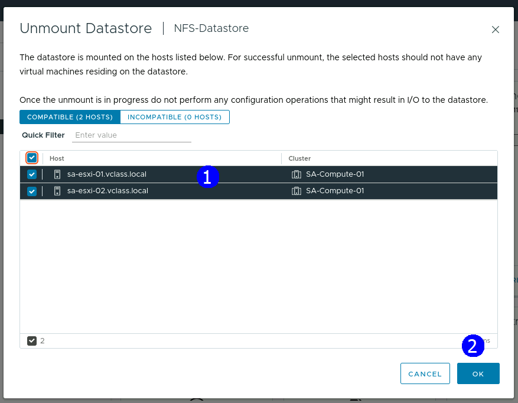

> # VMware vSphere
>
> ## Instalación configuración y Administración
>
> ### Versión 8.x
>
> #### Guía de uso de laboratorio

## **Laboratorio \# 8**

### **DataStores NFS**

Actividades a realizar:

1.  Creación de un datastore NFS

## **Actividad \# 1**

### **Creación de un dataStore NFS**

Utilizar de su sistema la herramienta de “Conexión a escritorio remoto”
con la dirección y puerto que le proporcionará su instructor; utilizar
como:

> Usuario: `vclass\Administrator`
>
> Contraseña: `VMware1!`

Abrir una instancia de Firefox, seleccionando el acceso rápido de
vCenter.

Para contar con un DataStore NFS, en la vista de DataStores (1), click
en el **Datacenter Production Datacenter** (2) , en el menú contextual
seleccionar **Storage** (3) click en **New Datastore** (4)

En el paso de tipo de DataStore, seleccionar NFS (2), Next (3)

Click en la versión NFS 4.1 (2), Next (3)

Establecer en nombre de dataStore como NFS-Datastore, Folder
`/mnt/NFS-POOL`, Server `172.20.10.15` (2)

Click en **Add** (3), Se agrega el servidor (1). Click en **NEXT** (2)

En la autenticación con Kerberos, aceptar el Default, Click en **NEXT**

Establecer que el DataStore NFS será visible para ambos host ESXi, click
en Compatible hosts (2), Next (4)

Revisar resumen de la configuración, FINISH (3)

Se presenta en la lista de DataStores en servicio de almacenamiento NFS
NFS-Datastore, visible desde los dos hosts ESXi.

Revisar el resumen del datastore NFS (2)

