# Práctica 14. Content Libraries

## Objetivos de la práctica:

- Crear una librería de contenido local.
- Clonar una plantilla en la librería con formato OVF.

## Duración aproximada:
- 20 minutos.
 

> Revisión 1.1 2024

## Instrucciones

## Actividad 1. Crear una librería de contenido local

Utilizar en su sistema la herramienta de “**Conexión a escritorio
remoto**” con la dirección y puerto que le proporcionará su instructor;
utilizar como:

> Usuario: `vclass\Administrator`
>
> Contraseña: `VMware1!`

Abrir una instancia de Firefox, seleccionar el acceso rápido de
**vCenter Server**.

Para la construcción de una librería de contenido, dar click en el **menú
principal** (1), click en **Content Libraries** (2), click en **New**
(3).

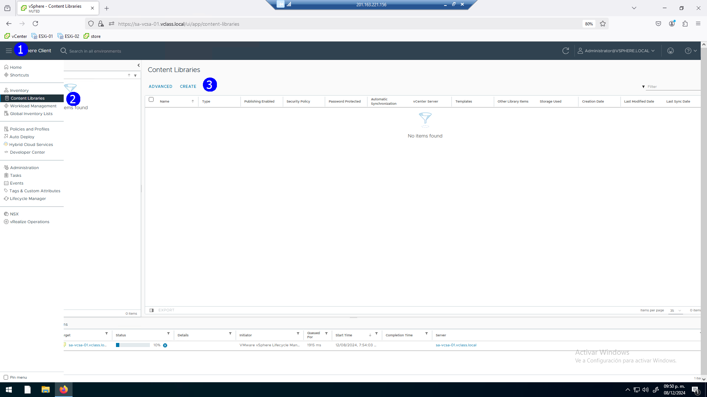

 

Establecer el nombre de la librería: **SA-Local-Content-Library**,
seleccionar el vcenter **sa-vcsa-01-vclass**, click **Next** (4).

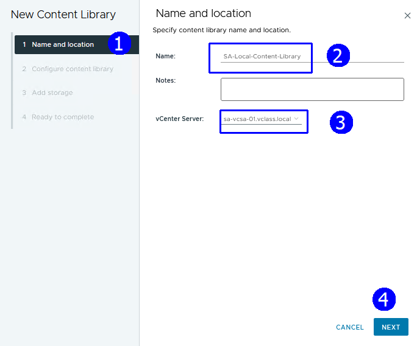

 

Definir que es una librería local (2), **Next** (3).

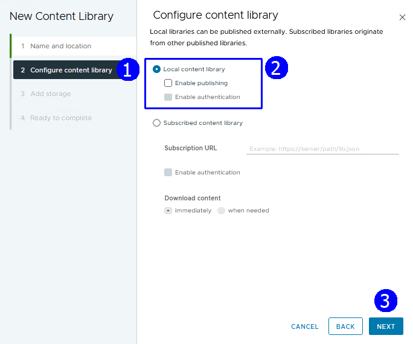

 

En el paso **Apply security policy**, por el momento no seleccionar
política (2), dar click en **Next** (3).

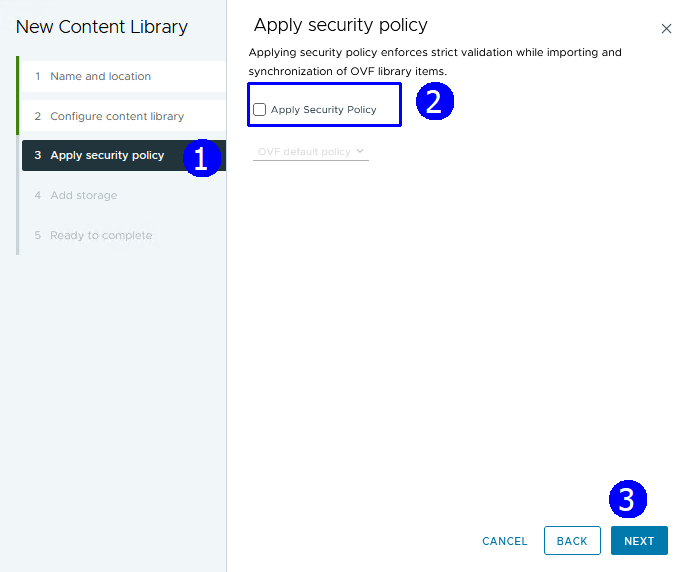

 

Establecer como sistema de almacenamiento **iSCSI-datastore** (2),
**Next** (3).

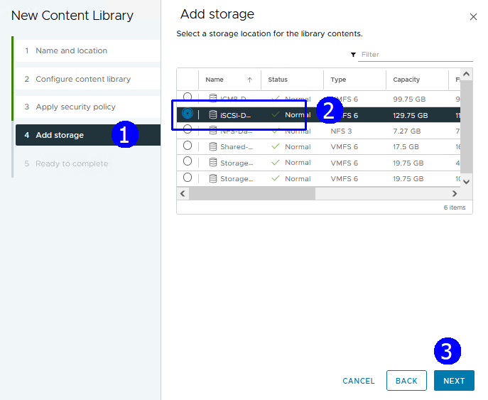

 

Revisar la configuración, aceptarla **FINISH** (3).

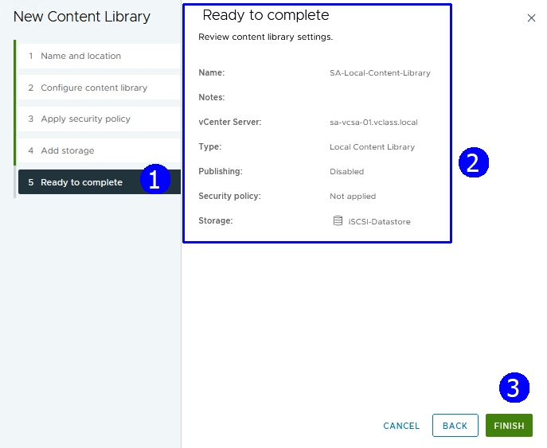

 

Se despliega la librería nueva **SA-Local-Content-Library** (1).

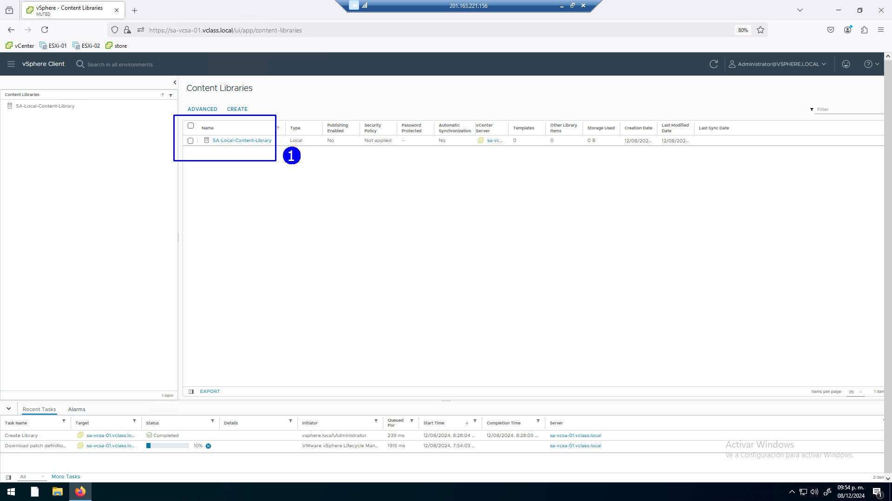

 

### Actividad 2. Clonar una plantilla en la librería con formato OVF

Agregar contenido a la librería, a manera de ejemplo una plantilla.

En la vista de **VMs & Templates** (1), abrir el folder **Production VMs
and Templates** (2), seleccionar la plantilla **Linux_01** en el menú
contextual click en **Clone to library (4)**.

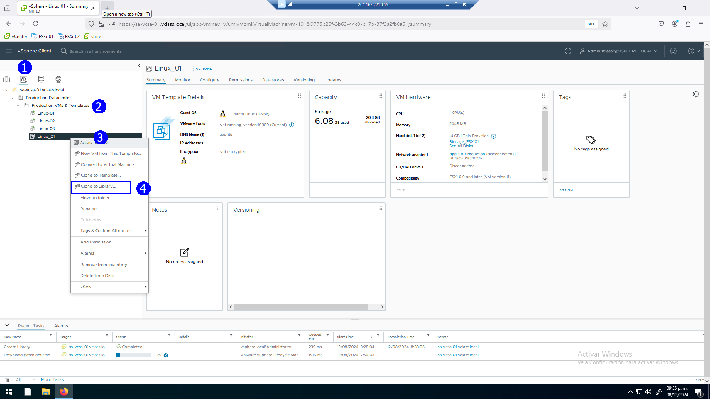

 

Determinar que es una nueva plantilla (1), click en la librería
**SA-Local-Content Library** (2), escribir el nombre de la **plantilla
Linux_OVF-library**-**Template** (3), **Next** (4). Dejar los demás 
con su valor de default, **OK** (4).

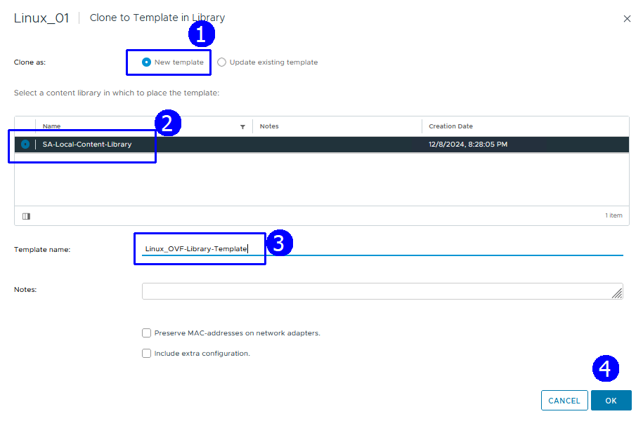

 

Para ver la nueva plantilla click en la librería (1).

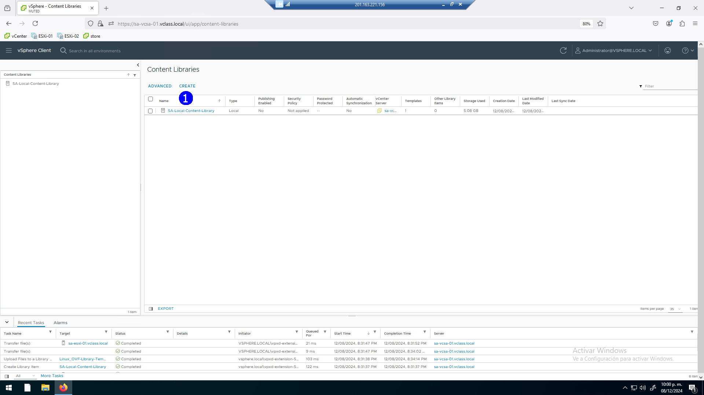

 

Se lista el tipo de plantilla **OVF & OVA Template** (1), con el nombre
`Linux OVF library template`#(2).

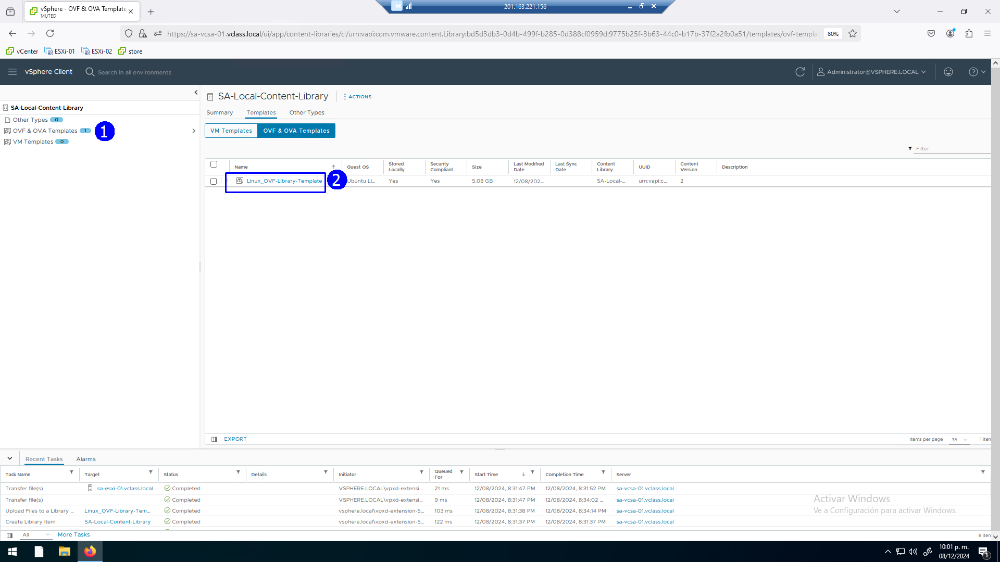

