# Práctica 19. Control de recursos de las máquinas virtuales

## Objetivos de la práctica:

- Crear condiciones de contención con afinidad de CPU.
- Revisar estadísticas con condiciones de contención.
- Uso de Shares para asignar recursos con prioridad.
- Observar estadísticas con nuevos recursos asignados.
- Restablecimiento de condiciones operativas normales.

## Duración aproximada:
- 30 minutos.
 

> Revisión 1.1 2024

## Instrucciones

### Actividad 1. Crear condiciones de contención con afinidad de CPU

Utilizar en su sistema la herramienta de “**Conexión a escritorio
remoto**” con la dirección y puerto que le proporcionará su instructor;
utilizar como:

> Usuario: `vclass\Administrator`
>
> Contraseña: `VMware1!`

Abrir una instancia de Firefox, seleccionar el acceso rápido de
**vCenter Server**.

Para crear condiciones de contención, instalar y ejecutar una
aplicación en las máquinas virtuales **Linux_01** y **Linux_02**.

Considerar el ambiente de laboratorio que se ha venido construyendo.

Iniciar con el lanzamiento de una **VM Linux_01**, en la vista de
**Host & clusters**, seleccionar la máquina virtual **Linux_01** y
activar la consola.

 

Los parámetros que gobiernan los recursos de una máquina virtual están
definidos en la caja de diálogo de especificaciones. Seleccionar en el
menú contextual la opción de **Edit Settings (4)**.

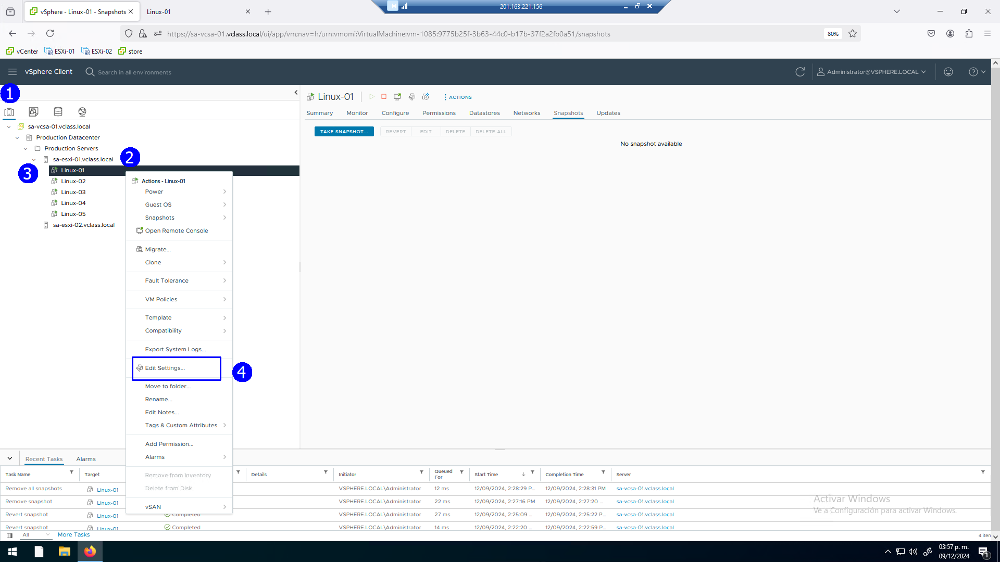

 

Para instalar una aplicación que consuma recursos, montar un ISO en
la unidad de CD/DVD. Seleccionar la opción de **Datastore ISO file**.

 

Presionar el botón **BROWSE (2)** para explorar el disco interno de la
máquina virtual.

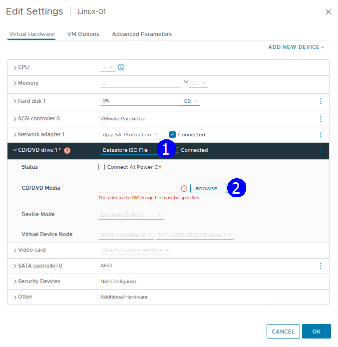

 

Seleccionar la unidad interna del host **ESXi_01** llamada
**Storage_ESXI01**.

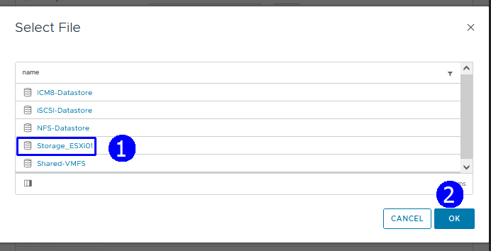

 

En el directorio principal seleccionar el ISO **Classfiles.ISO** (2),
**OK** (3).

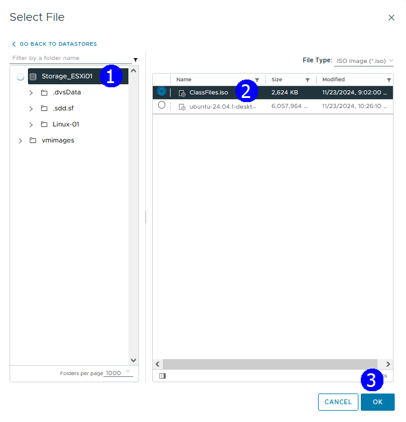

 

Asegurar que la unidad de CD/DVD conectada a la imagen ISO de la VM
esté en estado **Conected (1)**.

 

Adicionalmente, en la misma caja de diálogo expandir la sección de CPU y
establecer **Scheduling Affinity (2)** con valor **0**. Esto significa
que todas las operaciones de la máquina virtual se realizarán únicamente
en el **CPU Físico 0**. Así, entonces se impone una restricción de
recursos. En donde el hipervisor no comparte los recursos de todos los
cpus físicos. **OK** (3).

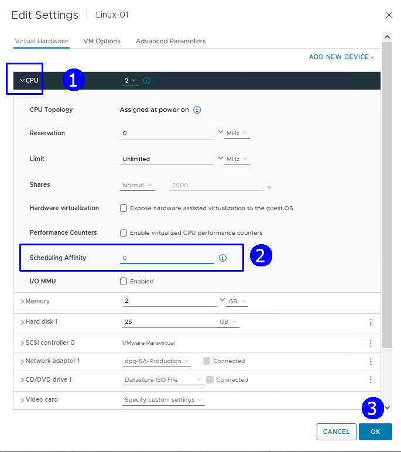

 

En la consola de la máquina virtual abrir la unidad de DVD que se ha
montado.

 

Se muestran al abrir el DVD los archivos relacionados con la aplicación
a utilizar.

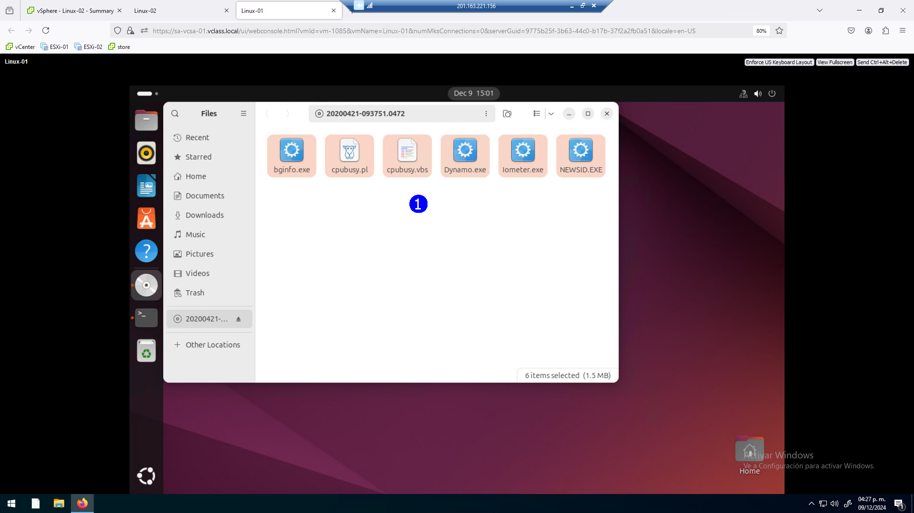

 

Copiar los archivos al escritorio, para esto sólo basta arrastrarlos con
el mouse.

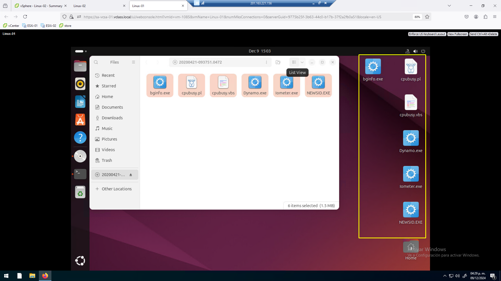

 

Lanzar la aplicación **Terminal** para emitir comandos en línea.

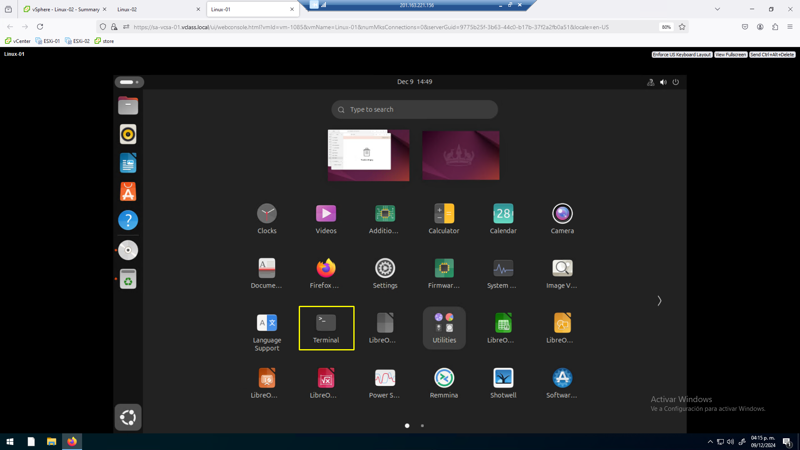

 

Emitir los siguientes comandos:

`ls`

`cd Desktop`

`hmod +x cpubusy.pl`

`perl ./cpubusy.pl`

Ejecutar una aplicación que realiza “N” operaciones matemáticas por
segundos.

Observar la estadística después de varios minutos al estabilizarse.

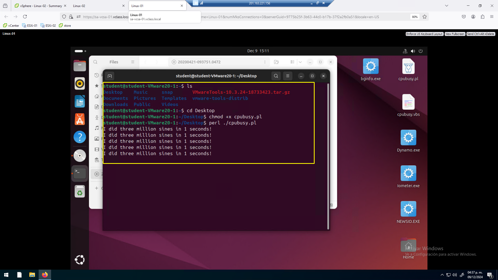

 

Realizar los mismos operativos en la máquina **Linux_02**.

Montar el ISO en la unidad de CD/DVD, establecer afinidad con el CPU 0.

 

### Actividad 2. Revisar estadísticas con condiciones de contención

Se muestran las estadísticas para la **Linux_02**.

En este caso cuando ambas máquinas solo usan el **CPU Físico 0**, el
número de operaciones por segundo disminuye y se estabiliza en un valor
menor de operaciones.

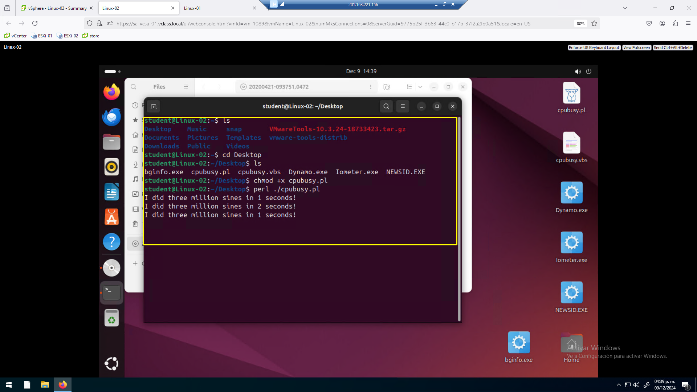

 

Observar que el número de shares de CPU normal es de 2000 en ambas
máquinas, en la ilustración se muestra la información de la **Linux_01**.

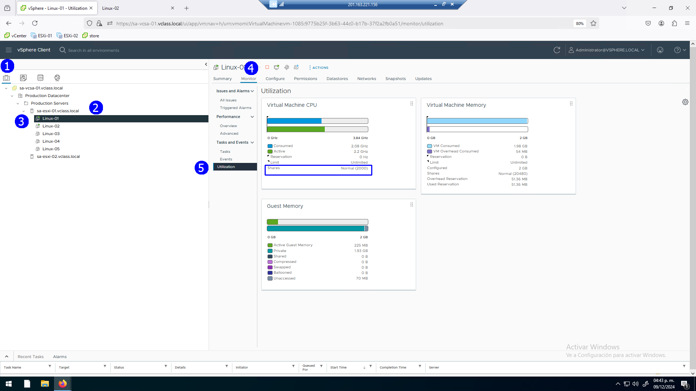

 

Con el número de Shares, se nota que ambas máquinas realizan en promedio
el mismo número de operaciones matemáticas. Si no tuvieran afinidad
sería mayor el número de operaciones.

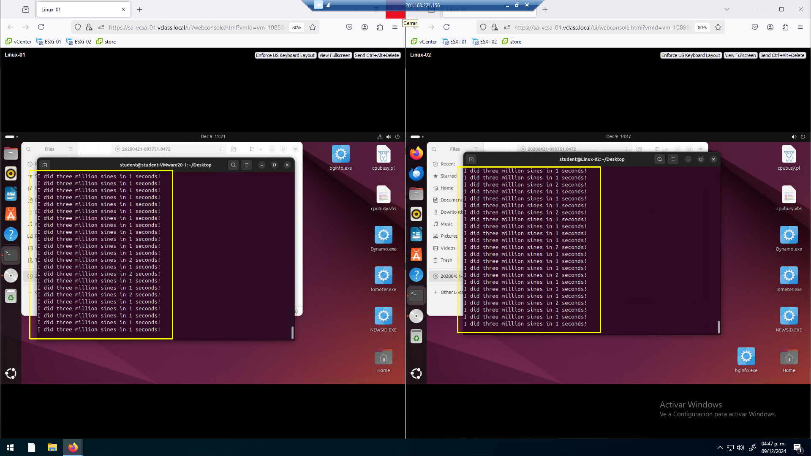

 

### Actividad 3. Observar estadísticas con nuevos recursos asignados

Modificar el número de shares en ambas máquinas. Establecer el número de
shares de **Linux_01** en valor de **4000**.

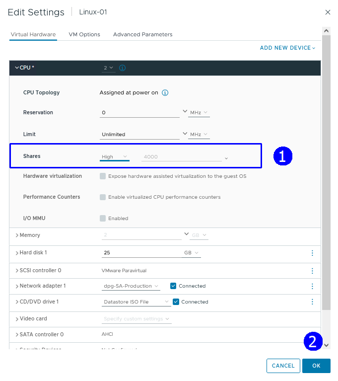

 

Establecer el número de shares de **Linux_02** en **500**.

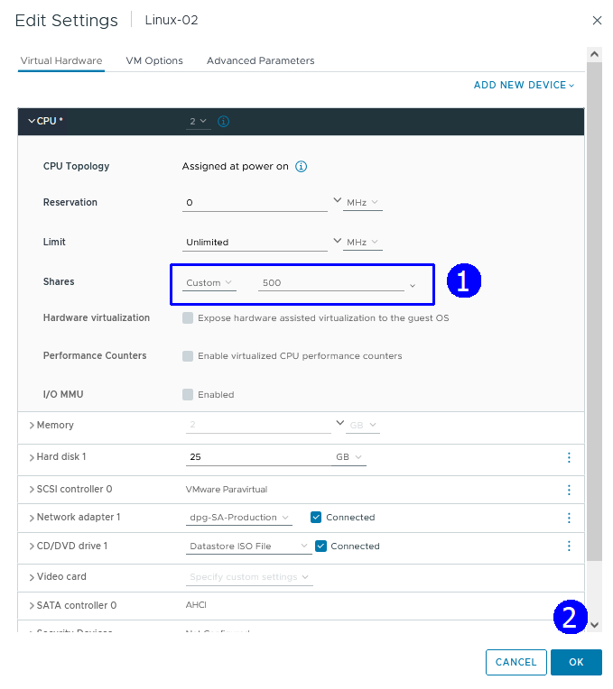

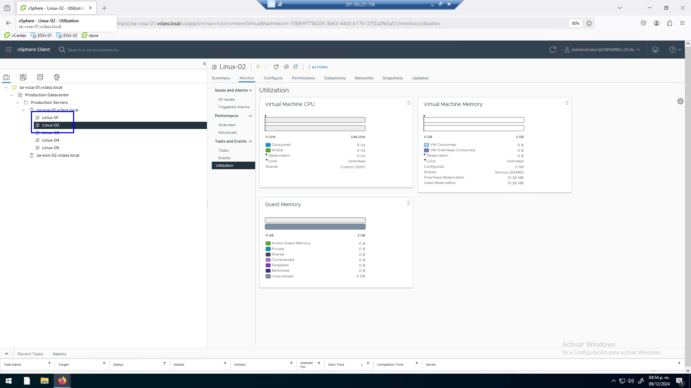

 

Se nota la diferencia de número de operaciones, ahora la VM **Linux_01**
tarda menos tiempo en realizar las operaciones.

Se está asignando el tiempo de operación del CPU 0 de forma diferente
para cada máquina

 

### Tarea 4. Restablecimiento de condiciones operativas normales

Interrumpir la aplicación en ambas máquinas para no afectar el resultado
de laboratorios subsecuentes.

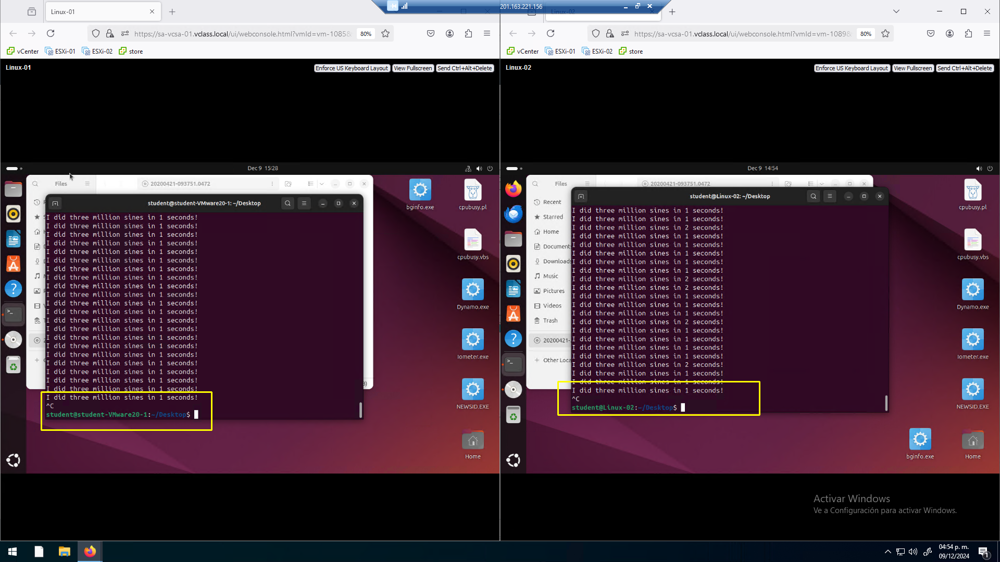

 

En ambas máquinas, retornar a los valores por default de Shares y
eliminar la afinidad de CPU.

Si no se elimina la afinidad no se podrá hacer vMotion con la máquina
virtual.

 

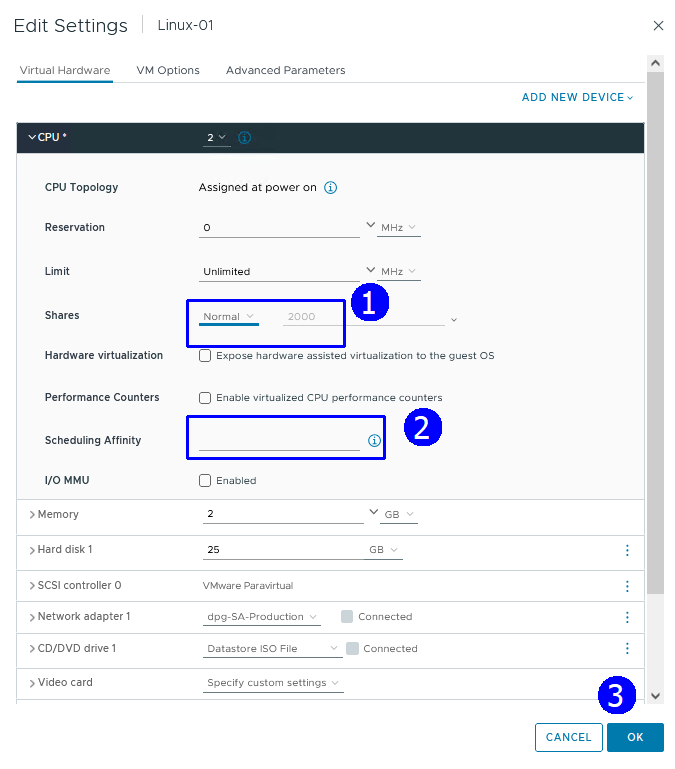

