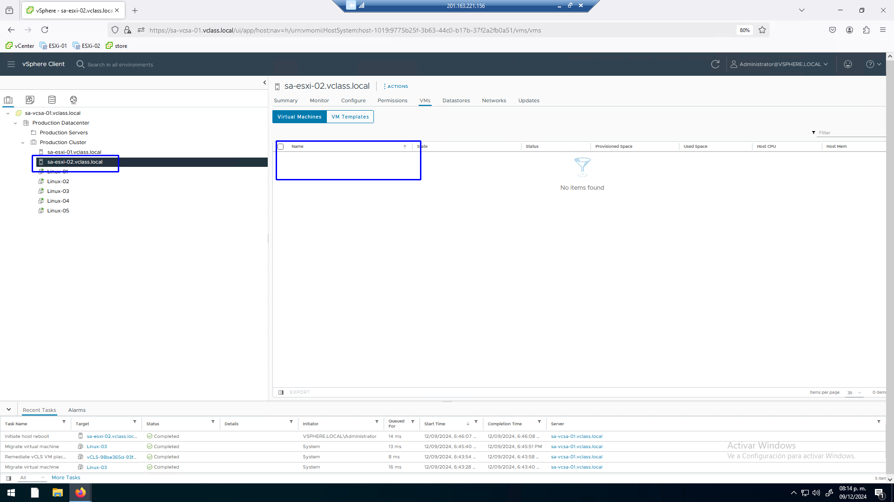

# Práctica 21. Alta disponibilidad con HA

## Objetivos de la práctica:

- Activar el servicio HA.
- Configurar el servicio HA.
- Operación de HA.
 
## Duración aproximada:
- 20 minutos.
 

> Revisión 1.1 2024

### Actividad 1. Activación del servicio HA

Utilizar en su sistema la herramienta de “**Conexión a escritorio
remoto**” con la dirección y puerto que le proporcionará su instructor;
utilizar como:

> Usuario: `vclass\Administrator`
>
> Contraseña: `VMware1!`

Abrir una instancia de Firefox, seleccionar el acceso rápido de
**vCenter Server**.

Para activar el servicio distribuido de HA.

Seleccionar en la vista de **Host & Clusters** (1) el cluster
**Production Center** (2). Hacer click en la pestaña Configure (3), click en
**vSphere Availability** (4)**,** click en **EDIT** (5).

 

Activar el seguro **vSphere HA** (1). Habilitar la opción **Enable Host
Monitoring** (2).

 

Se despliega la configuración del servicio.

 

Averiguar que elementos están protegidos con el servicio.

Seleccionar el cluster (2), click en la pestaña **Monitor** (3). En la
sección de **vSphere HA** seleccionar **Summary** (4), notar que el host
primario es el **Host –ESXi_02** (5), hay dos VMs protegidas.

 
 

### Tarea 2. Configuración del servicio HA

Para esquemas de protección en HA se pueden utilizar los DataStores de
Hearbeat.

Para identificarlos seleccionar el **cluster** (2). Hacer click en la pestaña de
**Monitor** (3), click en **Hearbeat** (4). Tenemos dos datastores de
hearbeat **ICM_Datastore** y **ISCSI_Datastore** (5).

 

En la activación del servicio podemos tener problemas de configuración,
a manera de ejemplo se notan estos dos casos:

Seleccionar el cluster **Production Clusters** (2). Hacer click en **Monitor**
(3), click en **Configuration Issues** (4).

Observar el mensaje de falta de red de redundancia en ambos hosts.

Notar en el inventario que los hosts están alarmados.

 

Si seleccionamos en el inventario un **host** (2) y damos click en la
pestaña de **Summary** (3), se muestra el mensaje:

**This host currently has no managment network redundancy** (4)

 

Para resolver esta alerta y proporcionar mayor protección a HA.

Activar el servicio de administración en una red que tenga ya un puerto
Vmkernel activo, lo haremos con el puerto de vMotion.

Seleccionar el **Host Esxi_01** (1), click en la pestaña **Configure**
(3), click en **Virtual Swithes** (4).

Expandir el vSwitch2. Hacer click en los puertos suspensivos del puerto
Vmkernel **vMotion** (5).

Click en **Edit Settings** (6).

 

Habilitar el servicio de **Managment** (1) en el puerto **VMkernel** que
actualmente proporciona el servicio de **vMotion**, OK (2).

1.  

 

Para resolver la alerta tendremos que reconfigurar HA.

Esto se logra a nivel del host. Seleccionar el host **ESXi_01** (2), en
el menú contextual seleccionar **Reconfigure for vSphere HA** (3).

 

La alerta se ha disuelto.

 

Realizar la misma operación en el host **Esxi_02**.

Seleccionar el host **ESX_02** en el inventario (2). Hacer click en
**Configure** (3). Click en **Virtual switches** (4). Expandir el
**vSwitch2** (5), click en los puntos suspensivos del puerto Vmkernel de
**vMotion** (6), click en **EDIT Settings** (7).

 

Activar el servicio de **Managment** (1) en el puerto VMkernel de
**vMotion**.

 

Solicitar la reconfiguración

Seleccionar el host **ESXi_02** (2). En el menú contextual seleccionar
la opción **Reconfigure for vSphere HA** (3).

 

Tenemos ya resuelta la alarma en el host **ESXI_02**.

 
 

### Actividad 3. Operación de HA

Para ver en acción a HA, notemos que máquinas virtuales están en el Host
**ESXi_02**.

Seleccionar el Host **ESXI_02** (2). Hacer click en la pestaña de VMs (3).
Notar que tenemos dos máquinas virtuales **Linux_04**, **Linux_05** y
una VM de servicios de **clusters vCLS** (4).

 

 

Para simular una falla, reiniciar el Host. Seleccionar el host **Esxi_02**
(2), en el menú contextual click en **Power** (3), seleccionar **Reboot** (4).
Nota: No usar **Shut Down**

 

En un primer momento se ve que el host se desconecta.

 

Seleccionar el host **ESXI_01**.
En unos minutos presenta ya todas las máquinas virtuales que estaban
alojadas en el host **ESXI_02**.

 

En el host **ESXi_02** no hay VMs conectadas.

 

Al restablecerse el estado de energía del host **ESXi_02** se mantiene
sin máquinas virtuales.

 

Todas las VMs siguen en el host **ESXI_01**.

 

Minutos más tarde, DRS detecta que los recursos no están balanceados y
migra las máquinas virtuales.

En el host **Esxi_01** permanecen las **Linux_01, Linux_02, Linux_03** y una VM
de servicios.

 

En el host **ESXI_02** se muestran activas las máquinas virtuales **Linux_03,
Linux_04** y una VM de servicios, el datacenter efectivamente está
protegido con HA y DRS vigila el rendimiento del cluster.

