# Práctica 8. DataStores NFS

## Objetivos de la práctica:
- Crear un datastore NFS.

## Duración aproximada:
- 10 minutos.
  
## Actividad 1. Creación de un dataStore NFS

Utilizar en su sistema la herramienta de “Conexión a escritorio remoto”
con la dirección y puerto que le proporcionará su instructor; utilizar
como:

> Usuario: `vclass\Administrator`
>
> Contraseña: `VMware1!`

Abrir una instancia de Firefox seleccionando el acceso rápido de
vCenter.

Para contar con un DataStore NFS, en la vista de DataStores (1) dar click
en el **Datacenter Production Datacenter** (2). En el menú contextual
seleccionar **Storage** (3). Dar click en **New Datastore** (4).

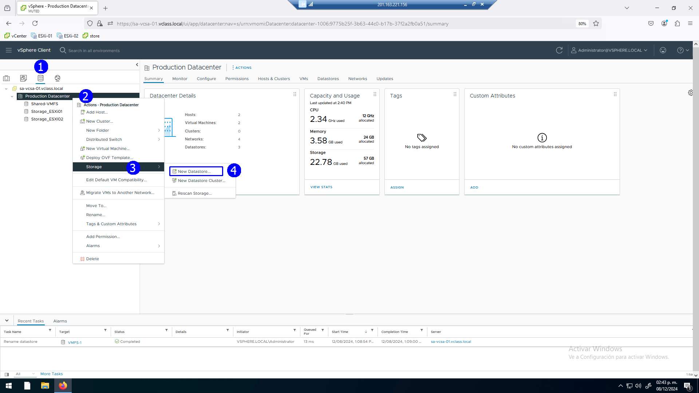

En el paso de tipo de DataStore, seleccionar NFS (2). Next (3).

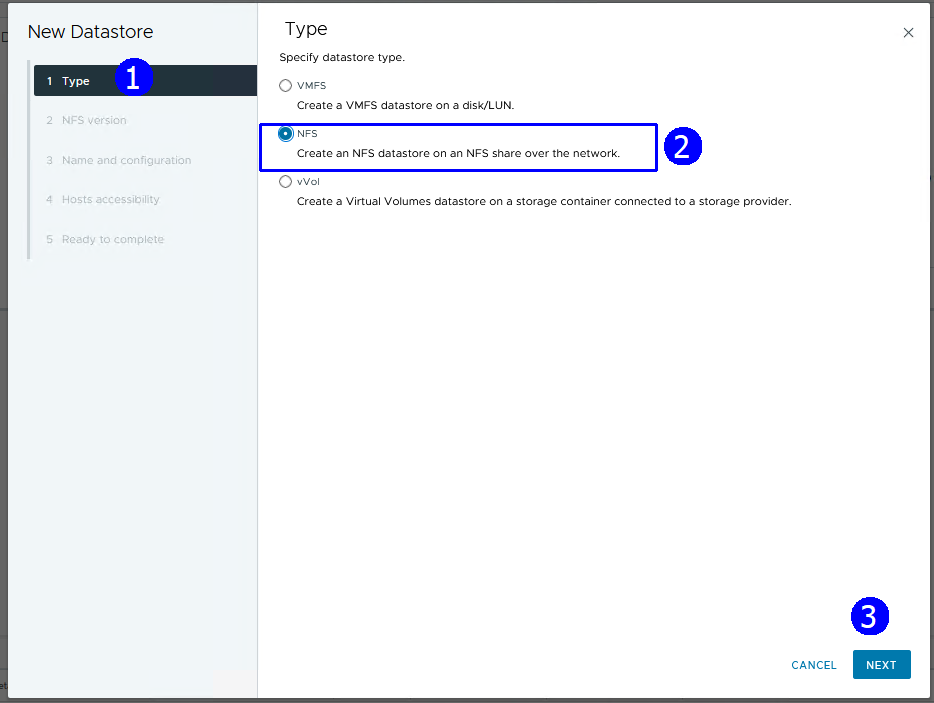

Dar click en la versión NFS 4.1 (2). Next (3).

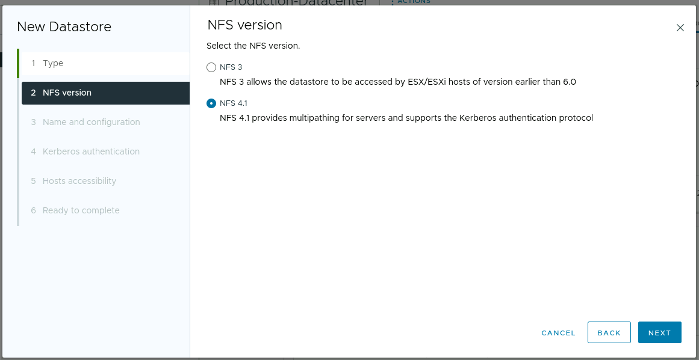

Establecer el nombre de dataStore como **NFS-Datastore**, Folder:
`/mnt/NFS-POOL`, Server `172.20.10.15` (2).

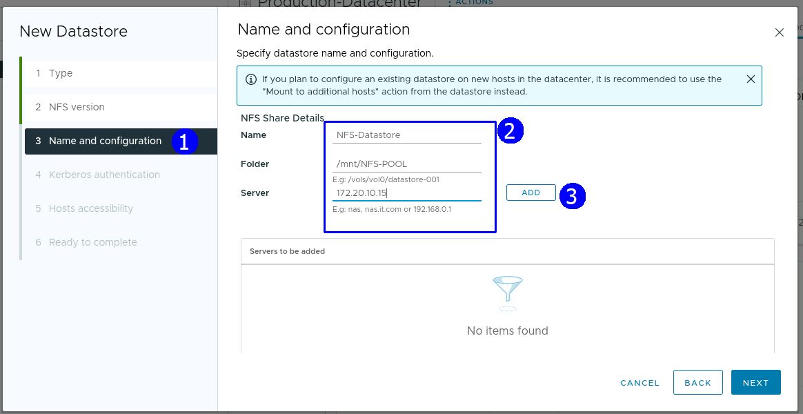

Dar click en **Add** (3). Se agrega el servidor (1). Next (2).

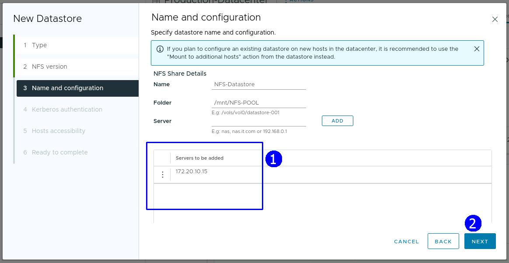

En la autenticación con Kerberos, aceptar el Default. Next (1).

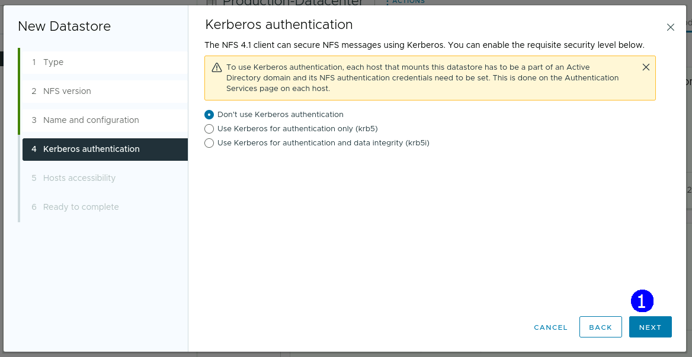

Establecer que el DataStore NFS será visible para ambos host ESXi, dar click
en Compatible hosts (2). Next (4).

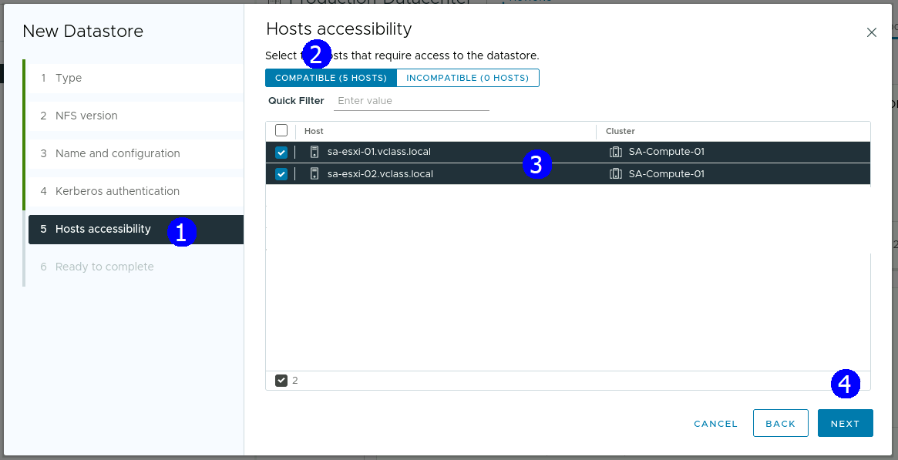

Revisar el resumen de la configuración. Finish (3).

Se presenta en la lista de DataStores en servicio de almacenamiento NFS
NFS-Datastore, visible desde los dos hosts ESXi.

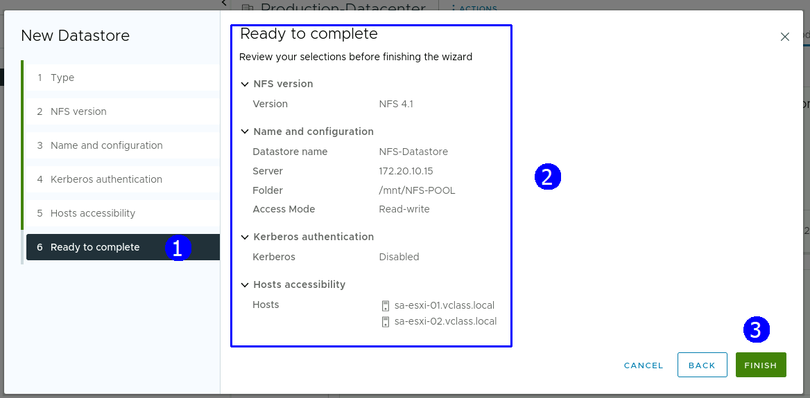

Revisar el resumen del datastore NFS (2).

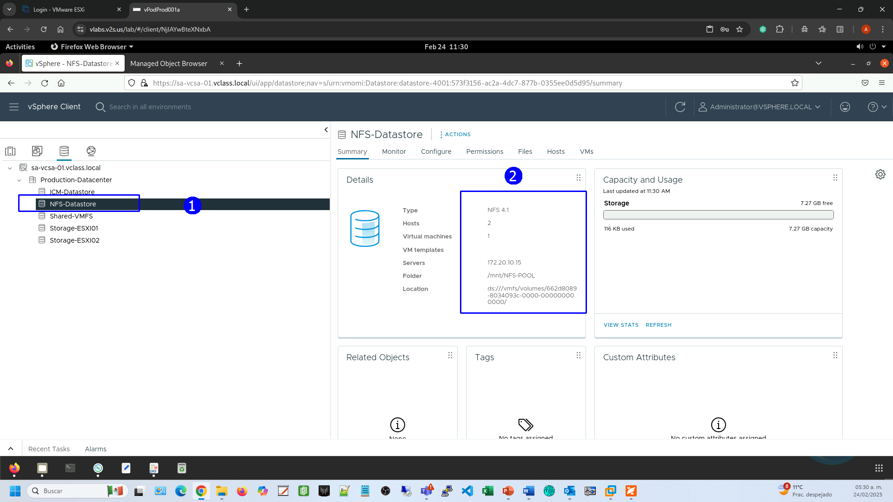

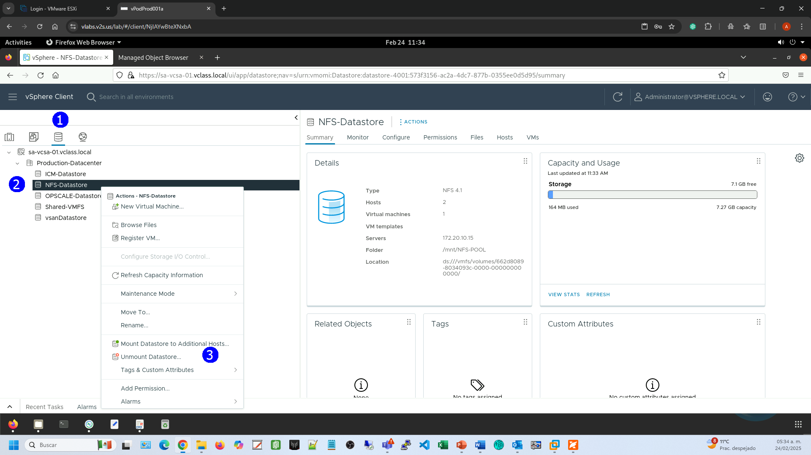

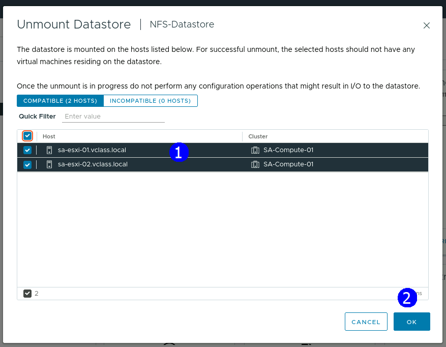
