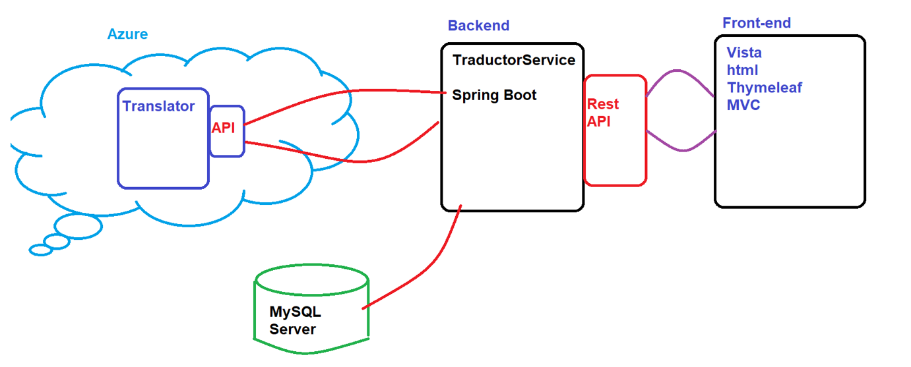

# Laboratorio 1. Acceso al escritorio remoto, exploración y configuración inicial en el host ESXi y vCenter Server 

## Objetivo de la práctica:

Al finalizar la práctica, serás capaz de:

- Acceder al escritorio remoto (espacio de trabajo continuo)
- Realizar la conexión, exploración y configuración del host ESXi
- Realizar la conexión, exploración y configuración del vCenter Server

## Objetivo Visual 
Crear un diagrama o imagen que resuma las actividades a realizar, un ejemplo es la siguiente imagen. 

## Duración aproximada:
- xx minutos.

## Instrucciones 

### Tarea 1. Acceder al escritorio remoto (espacio de trabajo continuo).
Paso 1. En cada uno de los laboratorios, se sugiere tener el acceso al escritorio remoto. Para esto, si no lo tiene activo en el momento, utiliza de tu sistema la herramienta de **“Conexión a escritorio remoto”** con la dirección y puerto que te proporcionará tu instructor.

- Usuario: **vclass\Administrator**
- Contraseña: **VMware1!**

A manera de ejemplo:

