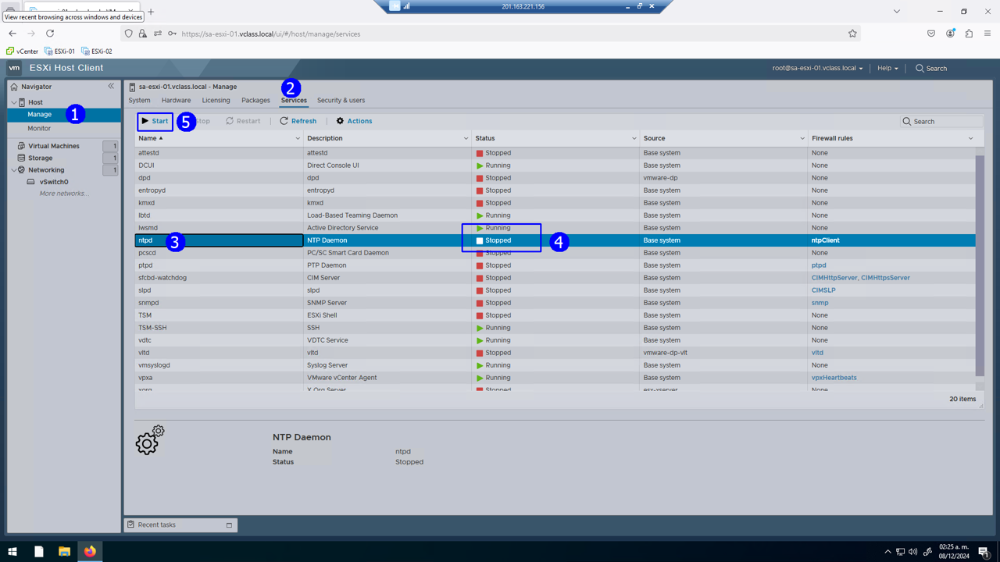

# Laboratorio 1. Acceso al escritorio remoto, exploración y configuración inicial en el host ESXi y vCenter Server 

## Objetivo de la práctica:

Al finalizar la práctica, serás capaz de:

- Acceder al escritorio remoto (espacio de trabajo continuo)
- Realizar la conexión, exploración y configuración del host ESXi
- Realizar la conexión, exploración y configuración del vCenter Server

## Objetivo Visual 
Crear un diagrama o imagen que resuma las actividades a realizar, un ejemplo es la siguiente imagen. 

## Duración aproximada:
- xx minutos.

## Instrucciones 

### Tarea 1. Acceder al escritorio remoto (espacio de trabajo continuo).
Paso 1. En cada uno de los laboratorios, se sugiere tener el acceso al escritorio remoto. Para esto, si no lo tiene activo en el momento, utiliza de tu sistema la herramienta de **“Conexión a escritorio remoto”** con la dirección y puerto que te proporcionará tu instructor.

- Usuario: **vclass\Administrator**
- Contraseña: **VMware1!**

A manera de ejemplo:

Te recomendamos guardar tu identidad y credenciales para futuros accesos.

Paso 2. Se presentará el escritorio remoto con el browser de Firefox.

Paso 3. Abre una instancia del browser Firefox; en la interfaz encontrarás tres accesos cortos en la barra de herramientas, a saber: vCenter, Esxi-01 y Esxi-02. Utilízalos según se requiera o indique.

### Tarea 2. Conexión, exploración y configuración del host ESXi.

Paso 1. Da click en el acceso corto del host **ESXi-01**.

Paso 2. Proporciona como:

- Usuario: **root**
- Contraseña: **VMware1!**

Paso 3. Da clic en el botón **LOGIN**.

Paso 4. Se presentará la interfaz del host client, en la misma se pueden distinguir el inventario por la izquierda (1), la información de versión por el centro (2) y las estadísticas de recursos por la derecha (3).

Paso 5. Da clic en **Virtual Machines** (1) y observa que tenemos en el inventario una máquina virtual (2) que se llama VM_01. 

Paso 6. Da clic en **Storage** (1). Observa que tenemos un **datastore** local (2) que se llama **Storage_ESXi01**. Este es un disco virtual VMFS interno del servidor.

Paso 7. Da clic en **vSwitch** (1).

Observar del lado derecho los elementos del **vSwitch0**:

Switch interno del host ESXi, con sus elementos a saber: red VM Network (2), con una máquina virtual asociada VM_01, (3) un puerto VMkernel con dirección 172.20.10.51, que se utiliza para administrar el Host ESXi y una tarjeta de red llamada vmnic 0 (4). 

### Tarea 3. Asociación del host ESXi a un dominio.

Paso 1. Da Dar Clic en **Manage** (1), después en **Security & Users** (2) y por último en **Join domain** (3).

Paso 2. En la ventana emergente proporciona la información de dominio: Username y password: **VMware1!**. Da clic en **Join Domain**, el host se asocia al dominio **vclass.local**.

### Tarea 4. Activar el servicio de SSH.

Paso 1. Da clic en **Manage** (1), después en **Services** (2) y por último en **TSM-SSH** (3). Observa que el servicio está detenido (4). Finalmente, da click en **Start** (5).

Observa que se ha iniciado el servicio (1) y (2).

### Tarea 5. Activar el servicio de NTP.

Paso 1. Da clic en **Manage** (1) > **System** (2) > **Time & date** (3). 

Observa que el servicio no está activo (4). Por lo tanto, da clic en **Edit NTP Settings** (5).

Paos 2. Configura en la ventana emergente: Clic en **Use Network Time Protocol (enable NTP Client)** (1).

Paso 2. Selecciona **Start and stop with host** (2) y proporciona la dirección IP del NTP server: <ins>172.20.10.2</ins> (3).

Paso 3. Como resultado estará el servicio configurado, pero detenido.

Para activarlo, da clic en: **Manage** (1) > **Services** (2), **ntpd** (3). 

Observa que está detenido (4). Por ello, da clic en **Start** (5).

El servicio ya está activo.

Paso 4. Enseguida click en Manage (1), click System (2), Click Time & date (3), observe que requiere actualización la interfaz, Click Refresh (5).

Finalmente se presenta ya activo NTP en la interfaz.

### Tarea 6. Asignación de Licencia al Host Esxi.
