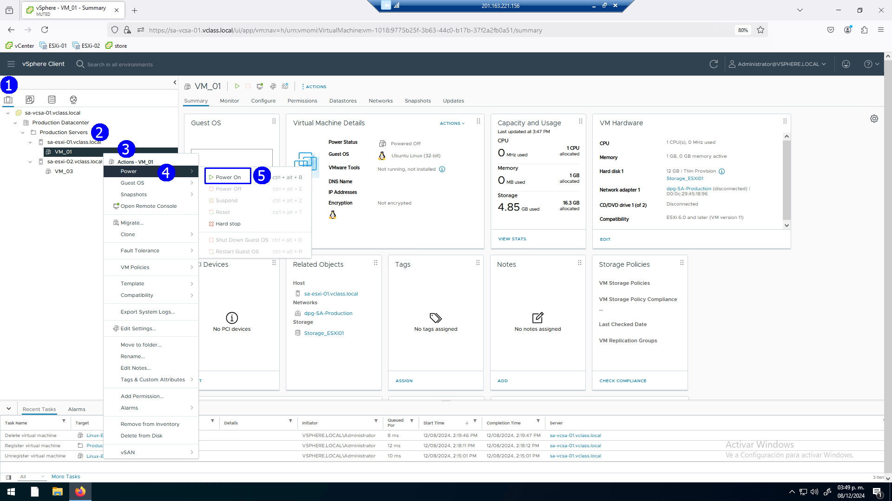
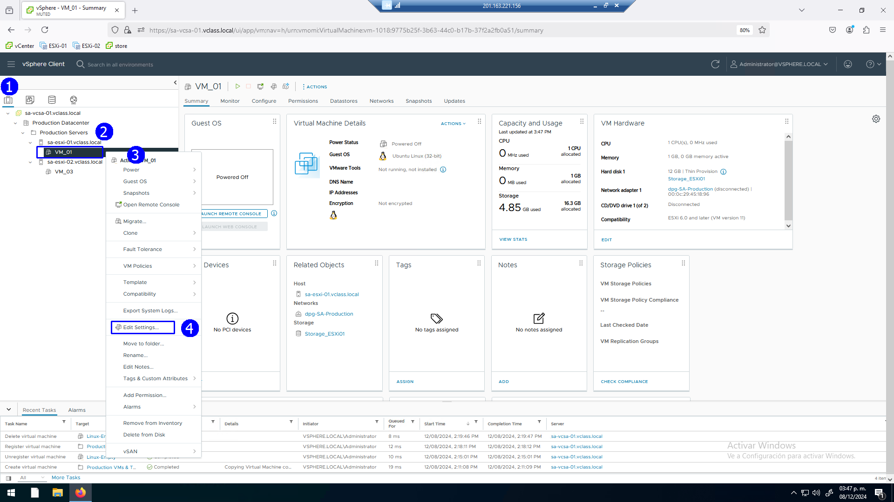
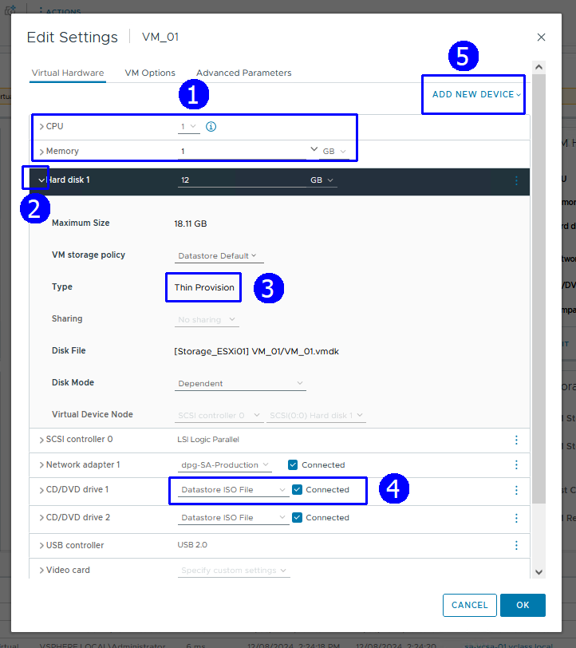
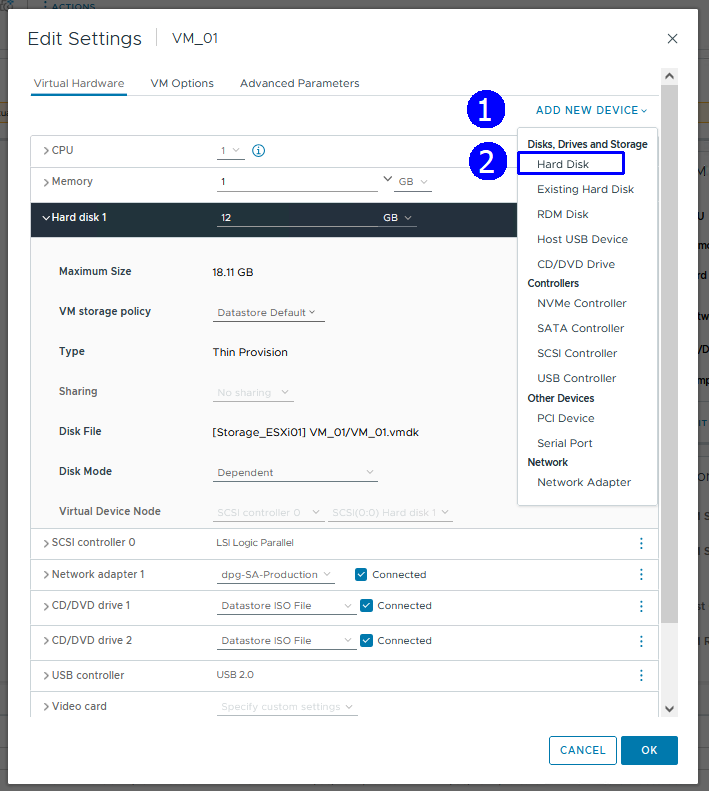
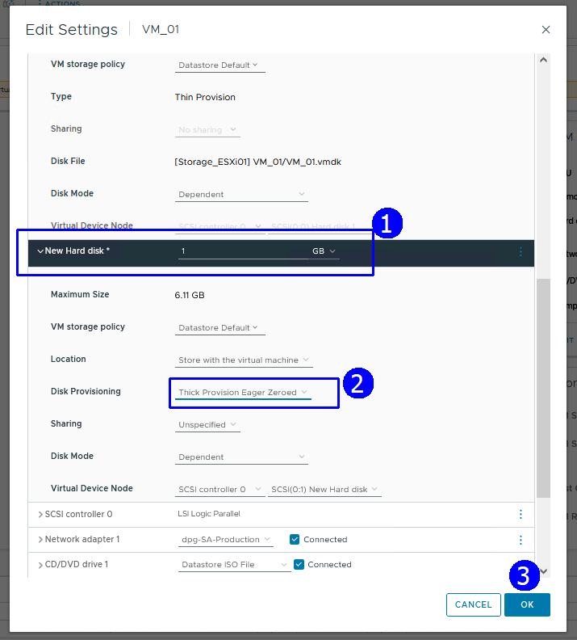
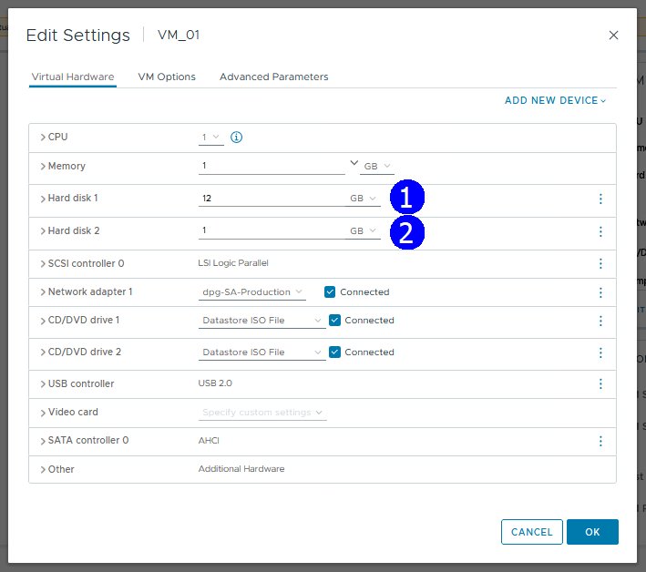
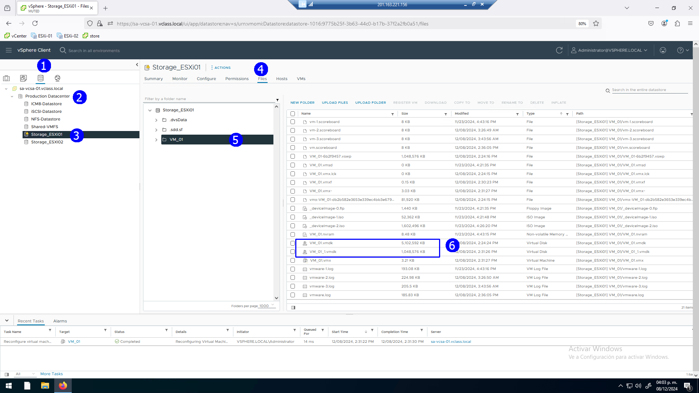

# Laboratorio \# 10

**Agregación de recursos en las VMs**

> Revisión 1.1 2024

## Laboratorio \# 10

**Agregación de recursos en las VMs**

Actividades a realizar:

1.  Agregar un disco con formato Thick Provision Eager Zeroed

## Actividad \# 1

**Agregar un disco con formato Thick Provision Eager Zeroed**

Utilizar de su sistema la herramienta de “**Conexión a escritorio
remoto**” con la dirección y puerto que le proporcionará su instructor;
utilizar como:

> Usuario: `vclass\Administrator`
>
> Contraseña: `VMware1!`

Abrir una instancia de Firefox, seleccionando el acceso rápido de
**vCenter Server**.

Con el propósito de explorar la agregación de recursos, encender la
**VM_01**, en la vista de **Hosts & Clusters** (1), click en el folder
**Production Servers** (2), seleccionar la VM **VM_01** (3), con el menú
contextual seleccionar **Power** (4) y **Power On** (5)

En la misma VM seleccionar con el menú contextual la opción **Edit
Settings** (4),

La ventana de especificaciones es el punto central de cambios.

Expandir la opción de **Hard Disk 1** (2) para identificar el tipo de
provisionamiento del disco, **Thin Provision** (3) y el estado de
conexión de la unidad de **CD/DVD**, hacia el ISO de instalación y
conectado (4)

Para agregar un disco, click **ADD NEW DEVICE** (1), Click **Hard Disk**
(2)

Expandir la sección **New Hard Disk**, determinar un 1 GB de tamaño (1),
establecer provisionamiento **Thick Provision Eager Zeroed** (2)

Ahora tenemos dos discos en la VM_01

Para examinar los archivos relacionados con los discos, en la vista de
Almacenamiento (1), click en **Production Datacenter**, click en
**Storage_ESXI01** (3), click en pestaña Files, Click en directorio
**VM_01**, se tienen a la vista los archivos correspondientes **vmdk**
(6)

