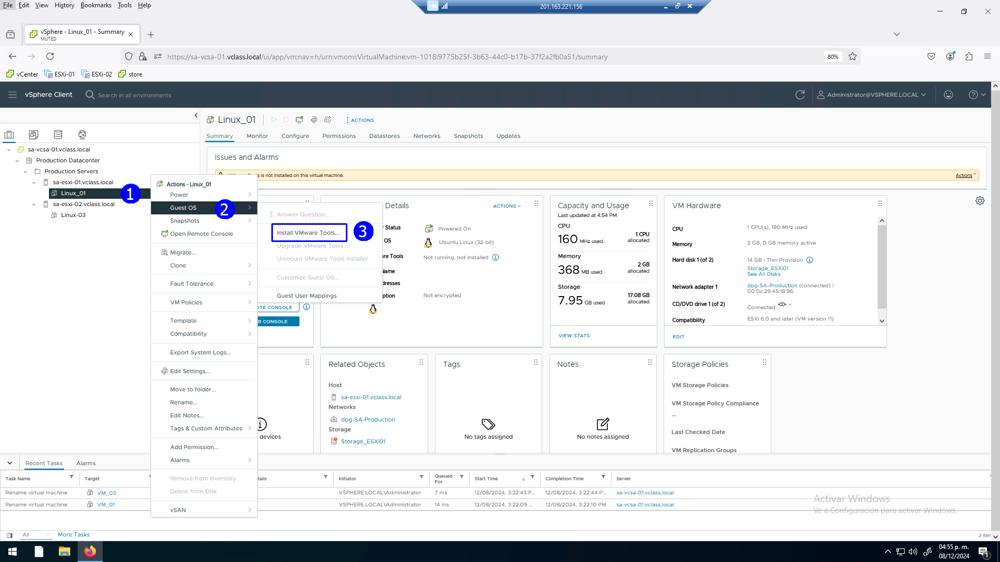
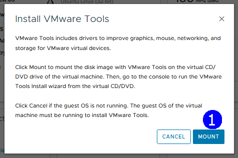
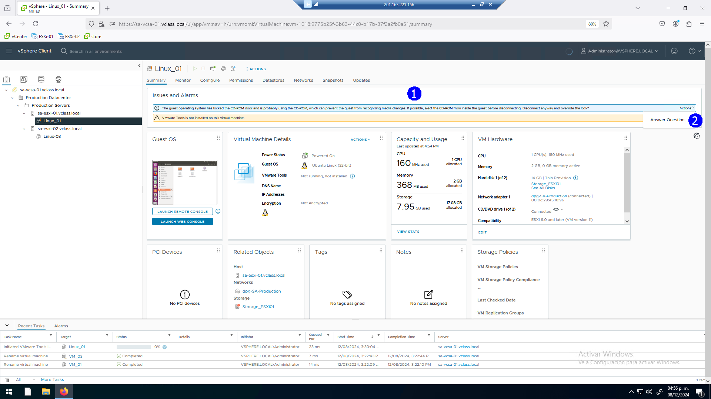
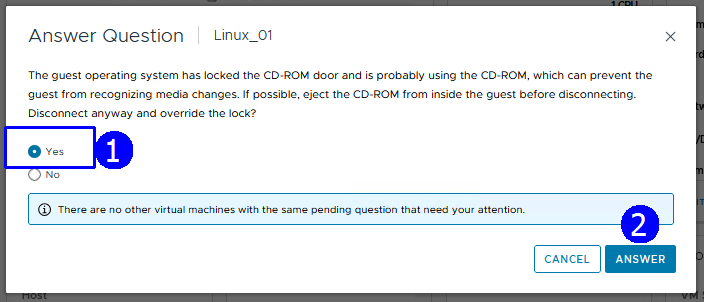
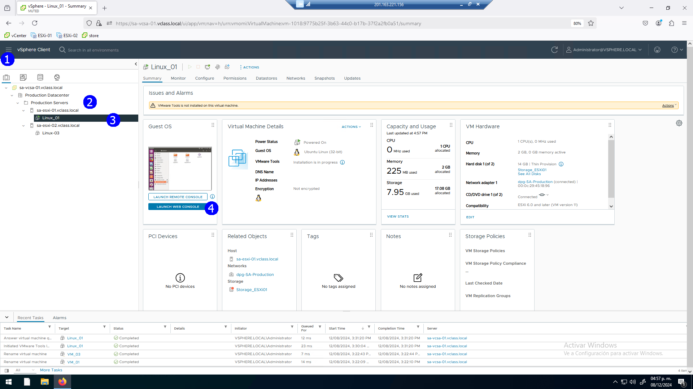
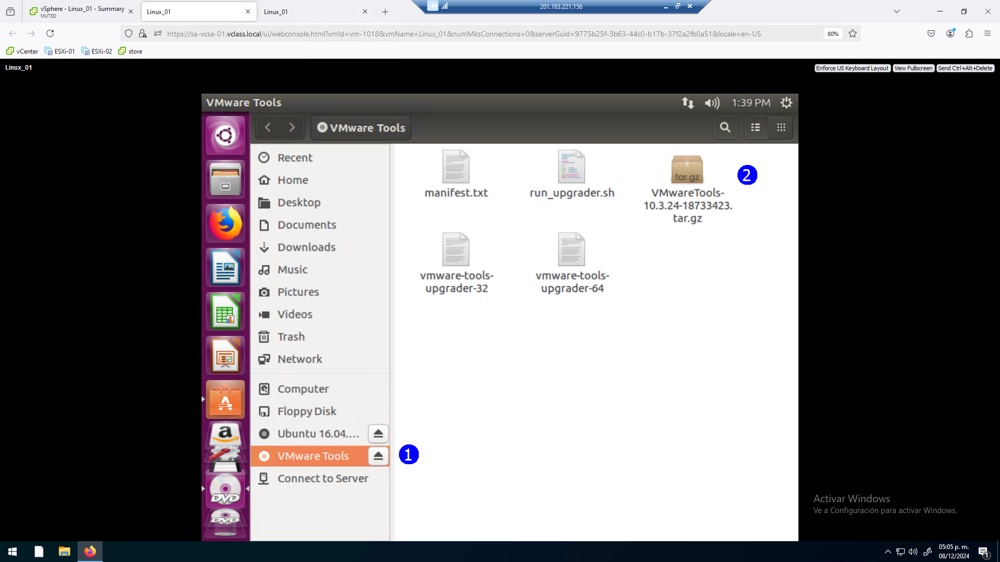
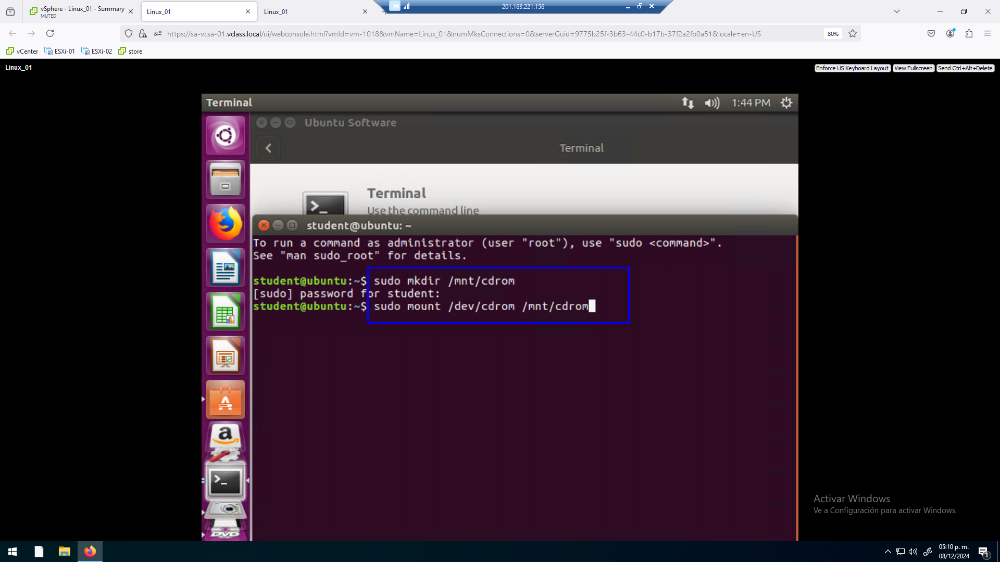
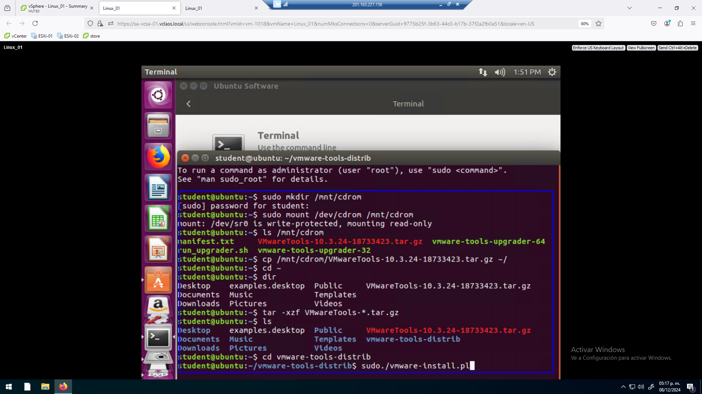
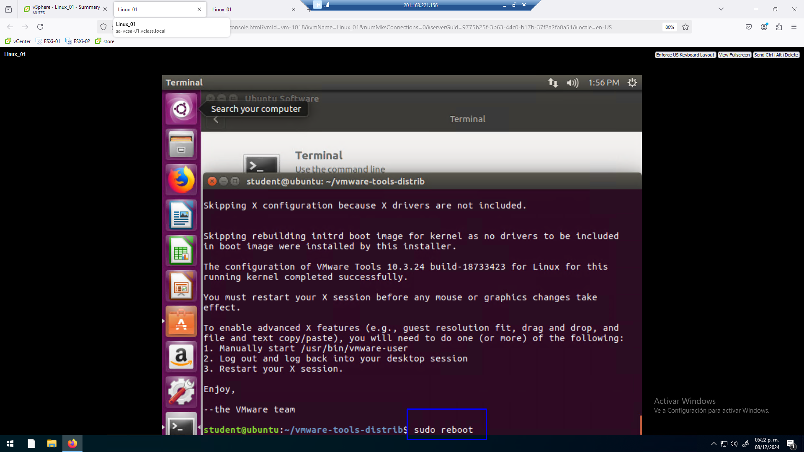
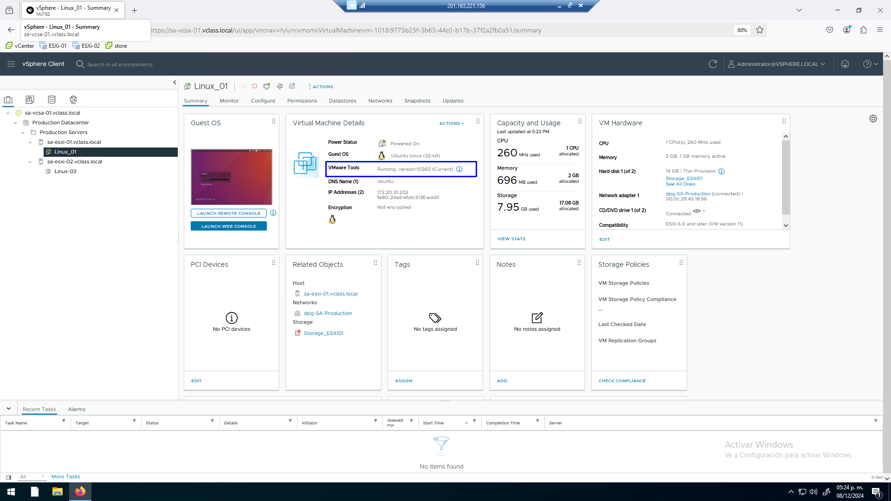

# Práctica 11. Instalación de las VMware Tools

## Objetivos de la práctica:
- Instalar las VMware Tools.

## Duración aproximada:
- 20 minutos.
 

> Revisión 1.1 2024

## Instrucciones

## Actividad 1. Instalación de las VMware Tools

Utilizar en su sistema la herramienta de “**Conexión a escritorio
remoto**” con la dirección y puerto que le proporcionará su instructor;
utilizar como:

> Usuario: `vclass\Administrator`
>
> Contraseña: `VMware1!`

Abrir una instancia de Firefox, seleccionar el acceso rápido de
**vCenter Server**.

Para instalar las VM tools en una máquina Linux de nuestro laboratorio,
dar click en la VM **Linux_01** (1). En el menú contextual seleccionar **Guest OS** (2) y dar click en **Install VMware Tools** (3), esto monta en la unidad de
CD/DVD los archivos de instalación.

 

Se despliega la ventana de información para señalar la operación en la
VM. **MOUNT** (1).

 

En la interfaz, cuando está seleccionada la VM en la que se pretenden
instalar las **VMware Tools**, con la pestaña Summary activa, se muestra un
mensaje de advertencia que se debe atender. Dar click en **Answer Question**
(2), cuando la VM tiene en el CD/DVD un sistema de archivos montado
previamente.

 

Se presenta la siguiente pregunta para aceptar cambios en el medio de
CD/DVD, seleccionar **Yes** (1). ANSWER.

(2)

 

Se elimina la advertencia, solicitar la consola de la VM. Dar click en LAUNCH
THE CONSOLE (4), ingresar con el password `VMware1!`.

 

Desplegar el contenido del CD/DVD (1), se mostrarán los files de las VM
tools (2).

 

Activar la aplicación **Terminal**, en la misma, emitir los siguientes
comandos, usar el password `VMware1!` cuando se solicite.

`sudo mkdir /mnt/cdrom`

`sudo mount /dev/cdrom /mnt/cdrom`

`ls /mnt/cdrom`

`cp /mnt/cdrom/VMwareTools-\*.tar.gz ~/`

`cd ~`

`tar -xzf VMwareTools-\*.tar.gz`

`cd vmware-tools-distrib`

`sudo ./vmware-install.pl`

 

Reiniciar el sistema operativo con el comando **sudo reboot**.

 

Ahora la VM muestra que las VMware tools están en ejecución.

