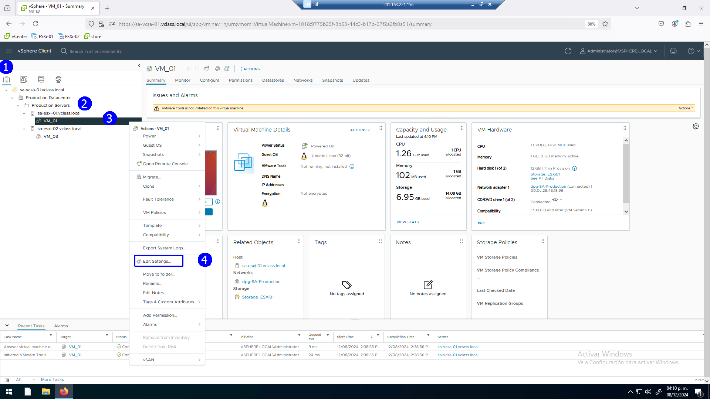
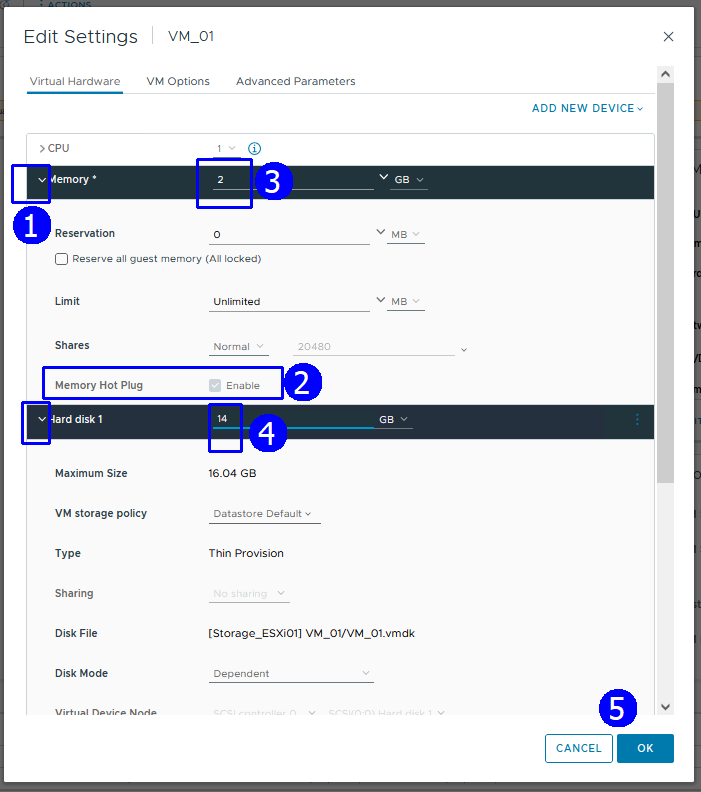
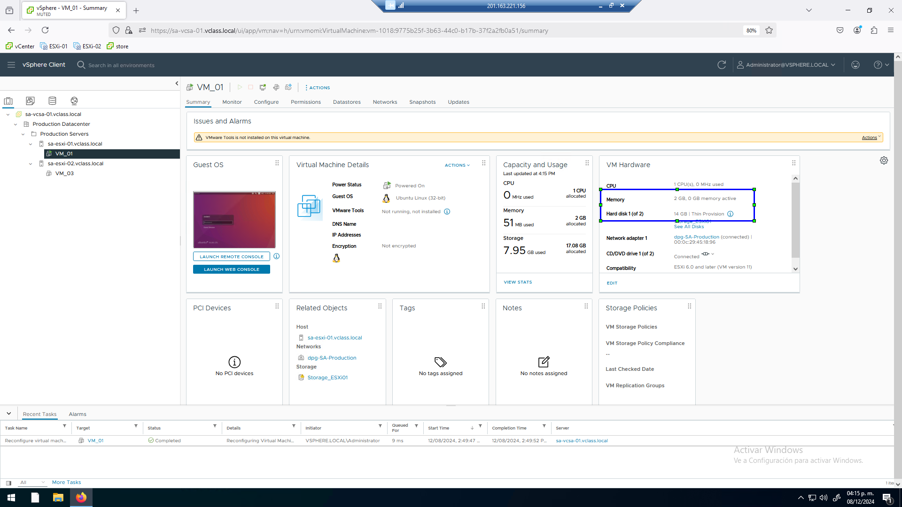
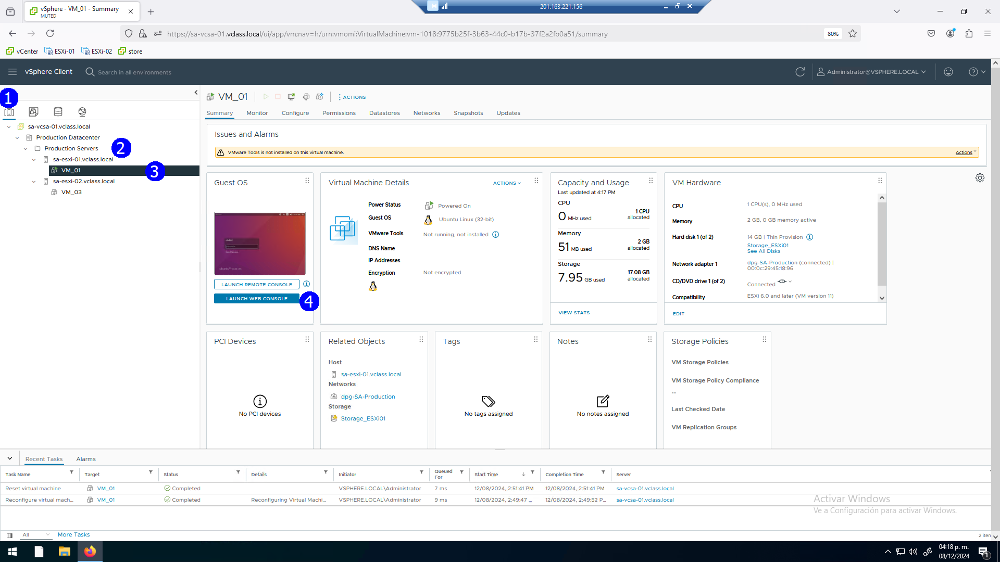
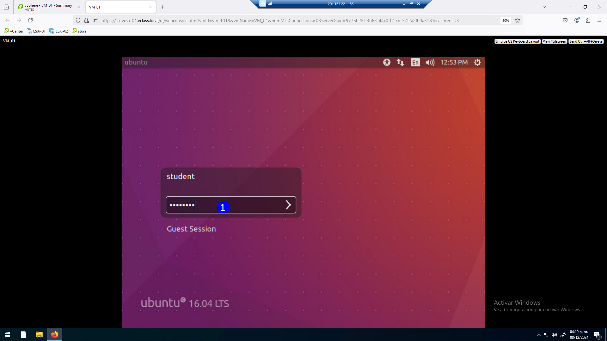
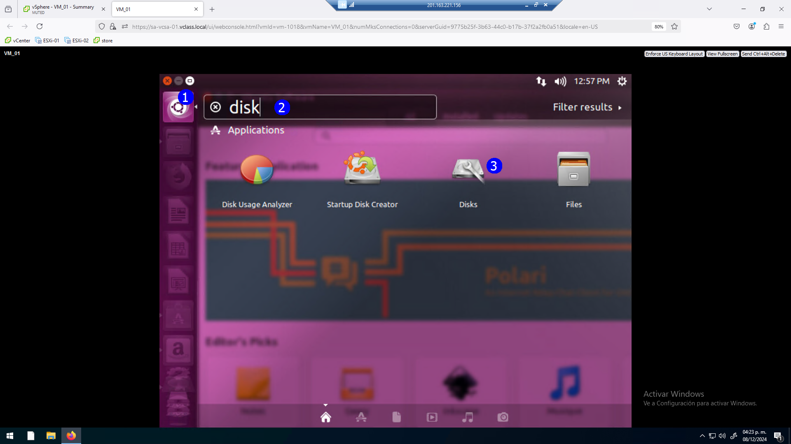
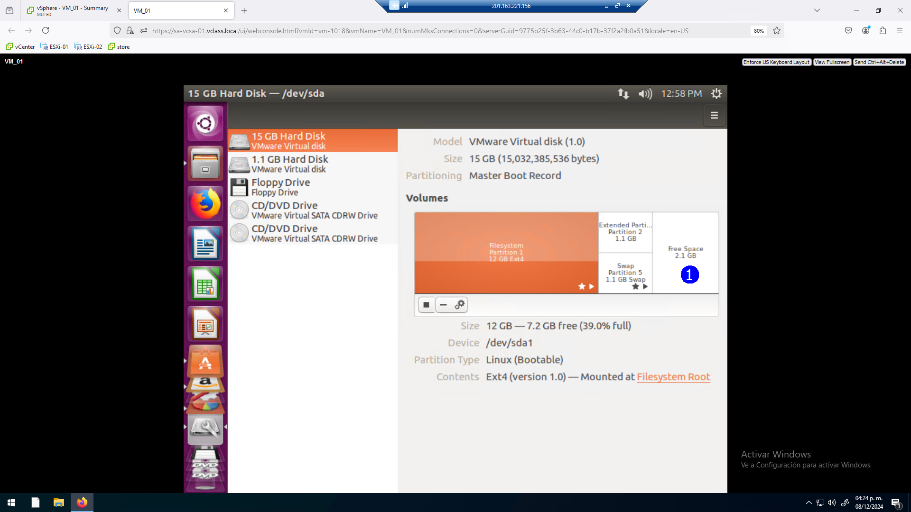
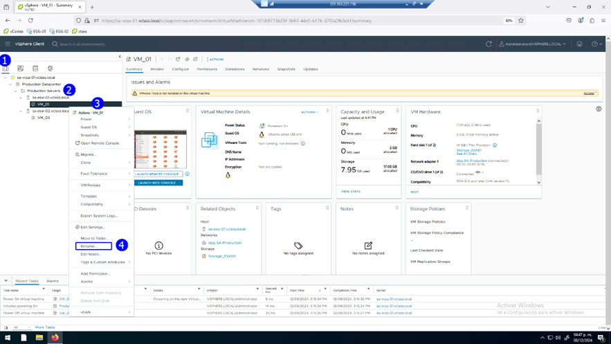
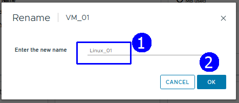
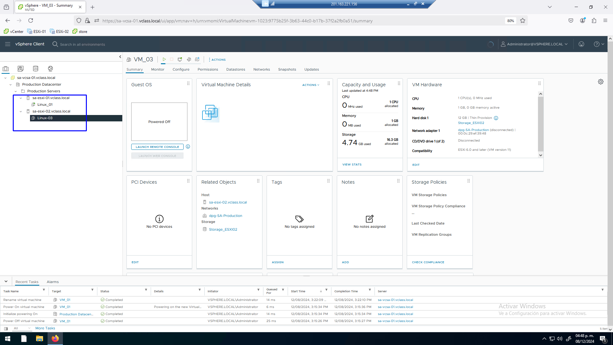

# Práctica 12. Incremento de recursos en las VMs

## Objetivos de la práctica:

- Incrementar la memoria virtual y capacidad de un disco.
- Cambiar de nombre de una VM. 

## Duración aproximada:
- 20 minutos.
 

> Revisión 1.1 2024

## Instrucciones

### Actividad 1. Incremento de memoria virtual y capacidad de un disco

Utilizar en su sistema la herramienta de “**Conexión a escritorio
remoto**” con la dirección y puerto que le proporcionará su instructor;
utilizar como:

> Usuario: `vclass\Administrator`
>
> Contraseña: `VMware1!`

Abrir una instancia de Firefox, seleccionar el acceso rápido de
**vCenter Server**.

Para aumentar la memoria en la vista de **Hosts & Clusters** (1), click
en el folder **Production Servers** (2). Seleccionar la VM **VM_01**
(3), en el menú contextual seleccionar **Edit Settings** (4).

 

En la ventana de especificaciones de la VM_01, expandir la sección de
**Memory** (1), verificar que esté activa la opción **Memory Hot Plug**
(2) y determinar 2 GB de memoria (3), aumentar también la capacidad del
disco a 14 GB (4) **OK**, (5).

 

Con la **VM_01** seleccionada y la pestaña **Summary** activa es posible
visualizar estos cambios, memoria y disco.

 

Solicitar la consola de la **VM_01** en la vista de **Hosts &
Clusters** (1), click en el folder **Production Servers** (2),
seleccionar la VM **VM_01** (3), click en **LAUNCH WEB CONSOLE** (4).

 

Accesar con el password `VMware1!`.

 

Ejecutar la aplicación **DISK** (3) del sistema operativo.

 

Se muestran las particiones establecidas en el sistema, seleccionar
primer disco, reclamar el espacio adicional (1).

 

### Actividad 2. Cambio de nombre de una VM

En la vista de **Hosts & Clusters** (1), click en el folder **Production
Servers** (2). Seleccionar la VM **VM_01** (3), en el menú contextual
seleccionar **Rename**.

 

El nuevo nombre será **Linux_01** (1), **OK** (2).

 

Se actualiza en nombre en el inventario.

