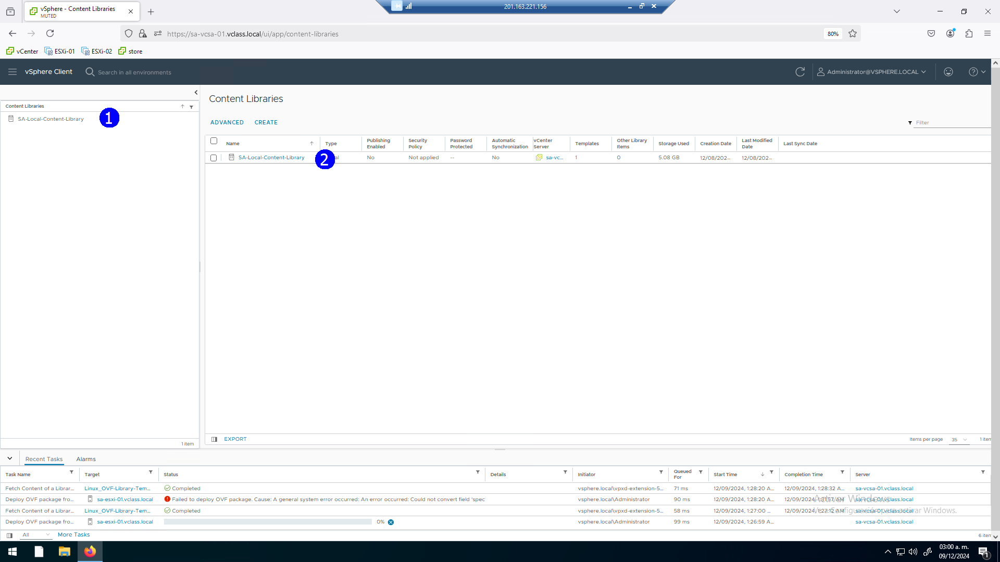
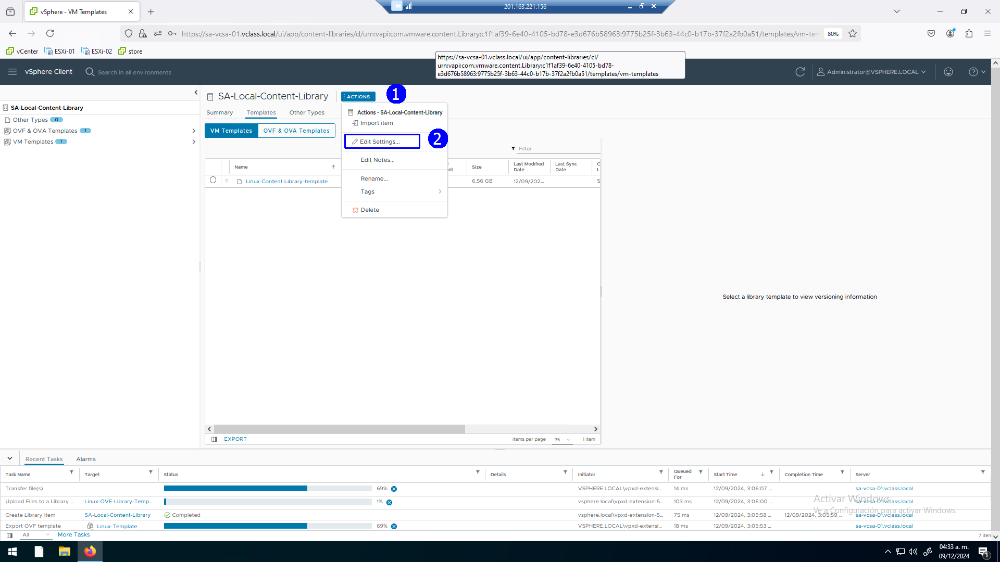
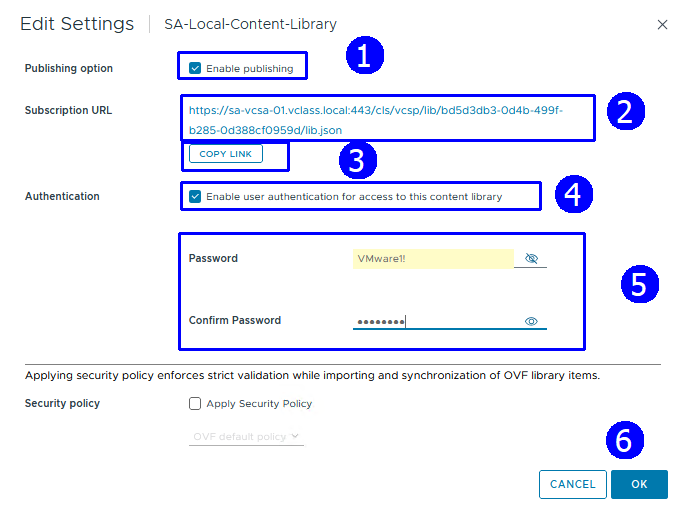
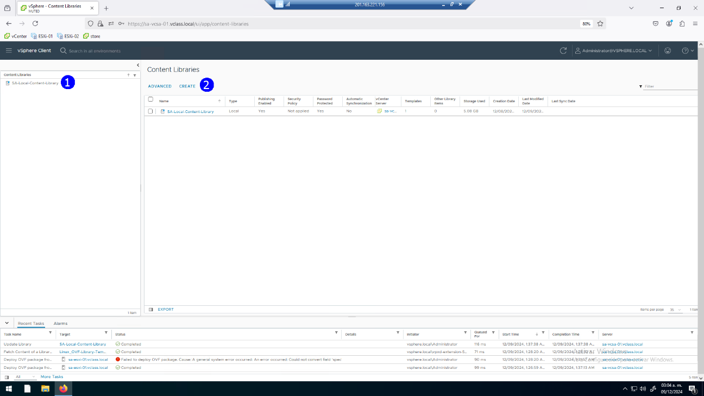
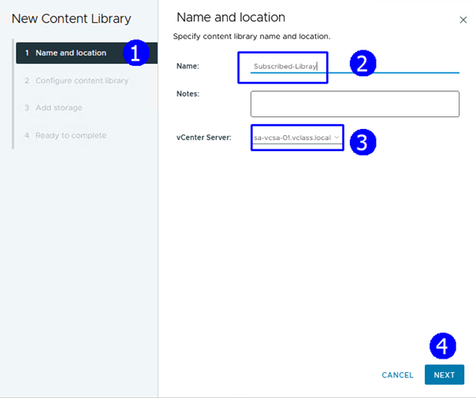
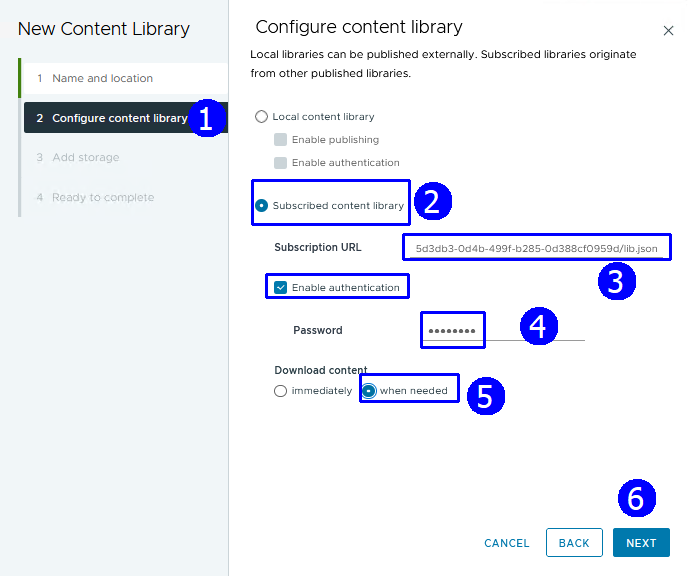
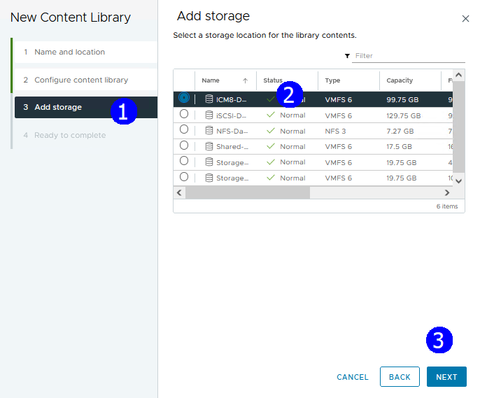
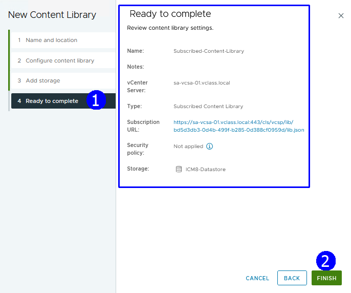
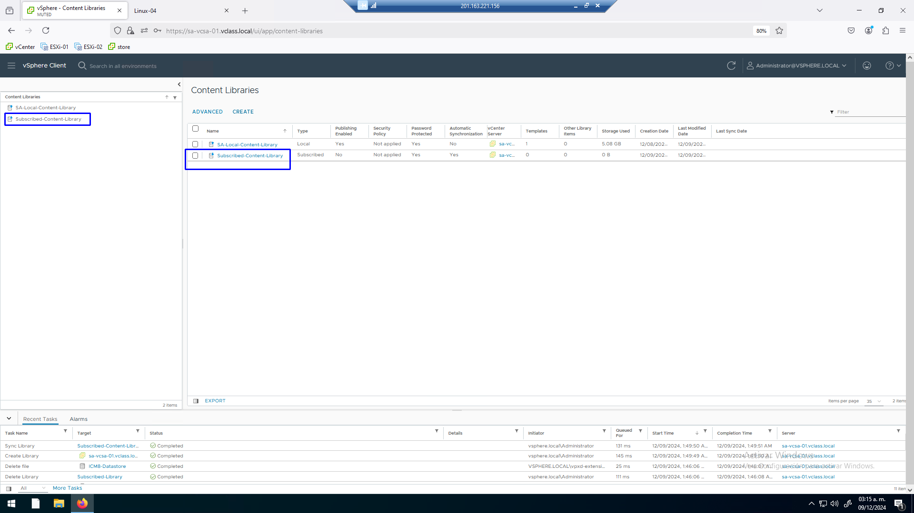

# Práctica 15. Crear una librería de contenido de subscripción

## Objetivos de la práctica:

- Publicar la librería de contenido local.
- Crear una librería de contenido de subscripción.

## Duración aproximada:
- 20 minutos.
  
 

> Revisión 1.1 2024

## Instrucciones

### Actividad 1. Publicar la librería de contenido local

Utilizar en su sistema la herramienta de “**Conexión a escritorio
remoto**” con la dirección y puerto que le proporcionará su instructor;
utilizar como:

> Usuario: `vclass\Administrator`
>
> Contraseña: `VMware1!`

Abrir una instancia de Firefox, seleccionar el acceso rápido de
**vCenter Server**.

Con el propósito de publicar nuestra librería de contenido, seleccionar
la librería **SA-Local-Content-Library** (2).

 

Seleccionar **Actions** (1), click en **Edit Settings** (2).

 

Se despliega la caja de configuración de la librería de contenido, en
ella, activar la publicación **Enable publishing**, con esto se genera
un URL de Subscripción (2), copiar esta información, click en **COPY
LINK** (3), activar la opción **Enable user authentication for Access to
this content library** (4), proporcionar el password `VMware1!` (5),
click **OK** (6).

 

Con el paso anterior logramos convertir la librería de contenido local a
una librería publicada.

Proceder a crear una librería de subscripción, que típicamente la
implementariamos en otro vCenter, incluso en un sitio remoto.

Sin embargo, lo podremos realizar en este mismo vCenter, click en
**CREATE** (2).

 

Proporcionar el nombre **Subscribed-Library** (2), seleccionar como
vCenter **sa-vcsa-01.vclass.local** (3), click **NEXT** (4).

 

En la caja de diálogo de configuración de la librería, seleccionar
**Subscribed content library** (2), pegar la URL de la librería local
publicada (3). Habilitar **Enable authentication**, establecer el
password `VMware1!` (4), la descarga de contenido establecerla como
**When needed** (5), **NEXT** (6).

 

En el paso **Add Storage**, seleccionar el datastore **ICM8-Datastore**
(2), **NEXT** (3).

 

Revisar la configuración final, aceptar **FINISH** (2).

 

Se muestra la nueva librería de contenido Subscribed-Content-Library, dar
click en la librería para ver su contenido.
