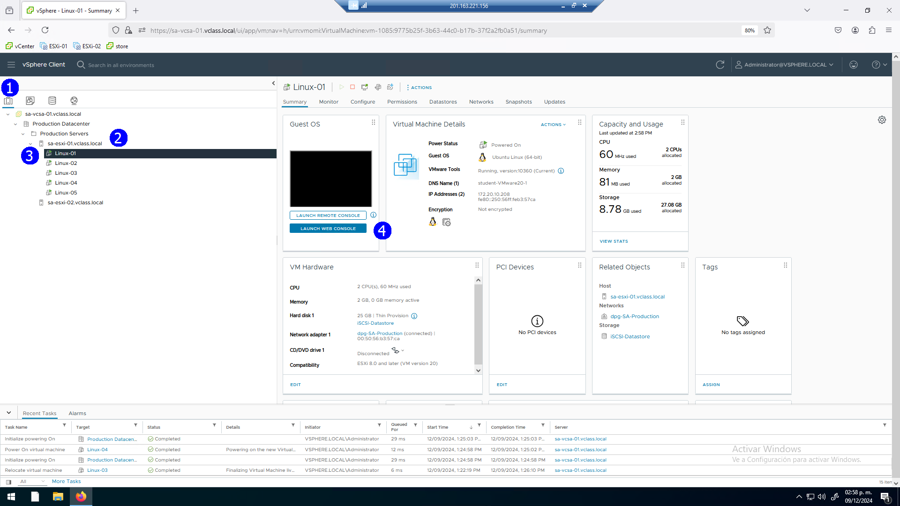

# Laboratorio \# 18

**Control de cambios con Snapshots**

> Revisión 1.1 2024

## Laboratorio \# 18

**Control de cambios con Snapshots**

Actividades a realizar:

1.  Activar una máquina virtual, reconocer su estado actual

2.  Crear un Snapshot como 1er punto de retorno

3.  Aplicar un primer cambio

4.  Crear un Snapshot como 2do punto de retorno

5.  Aplicar un segundo cambio

6.  Crear un Snapshot como 3er punto de retorno

7.  Aplicación del último punto de retorno

8.  Uso de la historia de Snapshots

## Actividad \# 1

**Activar una máquina virtual, reconocer su estado actual**

Utilizar de su sistema la herramienta de “**Conexión a escritorio
remoto**” con la dirección y puerto que le proporcionará su instructor;
utilizar como:

> Usuario: `vclass\Administrator`
>
> Contraseña: `VMware1!`

Abrir una instancia de Firefox, seleccionando el acceso rápido de
**vCenter Server**.

Consideremos el ambiente de laboratorio que se ha venido construyendo

Iniciemos con el lanzamiento de una **VM Linux_01**

En la vista de **Host & clusters** (1), seleccionemos la máquina virtual
**Linux_01 (3)** y activemos la consola

Usar en el acceso el password `VMware1!`

Se muestra la consola con el estado actual de nuestra máquina
**Linux_01,** nuestros cambios se enfocarán en los accesos directos de
aplicaciones en la barra izquierda, con cambios progresivos.

## Actividad \#2

**Crear un Snapshot como 1er punto de retorno**

En la vista de **Host & Clusters** (1), seleccionamos la máquina virtual
**linux_01** (3), tomamos un primer snapshot del menú contextual **Take
Snapshot** (5).

Se presenta la ventana de configuración del Snapshot.

Proporcionar nombre: **Linux Desktop default** (1), incluir en el
Snapshot el registro de memoria de la VM (2), esto asegura en el retorno
a la VM al usar el snapshot tener la VM encendida, si no se activa, al
retornar tendremos la VM apagada. Con las **VM tools** podemos activar
la opción de **Quiesce** para VM intensivas, **CREATE** (3)

## Actividad \# 3

**Aplicar un primer cambio**

A manera de cambio eliminemos del escritorio los accesos directos de los
navegadores.

Se muestra en la imagen el estado a captar en el siguiente Snapshot

## Actividad \# 4

**Crear un Snapshot como 2do punto de retorno**

En la vista de **Host & Clusters** (1), seleccionamos la máquina virtual
**Linux_01**(3), tomamos un segundo snapshot usando el menú contextual
**Take Snapshot** (5)

Se presenta la ventana de configuración del Snapshot.

Proporcionar como nombre: **Desktop without browsers in bar** (1),
incluir en el Snapshot el registro de memoria de la VM (2), **CREATE**
(3).

## Actividad \# 5

**Aplicar un segundo cambio**

En la máquina virtual aplicamos un segundo cambio, eliminar los accesos
directos en el desktop de las aplicaciones por default

## Actividad \# 6

**Crear un Snapshot como 3er punto de retorno**

En secuencia creamos tercer snapshot, en la vista de **Host & Clusters**
(1), seleccionamos la máquina virtual **Linux_01**, tomamos un tercer
snapshot usando el menú contextual **Take Snapshot** (5).

Se presenta la ventana de configuración del Snapshot.

Proporcionar como nombre: **Desktop without apps in bar** (2), incluir
en el Snapshot el registro de memoria de la VM, **CREATE** (3).

## Actividad \# 7

**Aplicación del último punto de retorno**

Para ilustrar como utilizar la opción de retorno al último snapshot

En la VM de la opción **Home** desplacemos el archivo de distribución de
**VM tools** al desktop.

Enseguida si nos interesa revertir los últimos cambios.

En la vista de **Host & Clusters** (1), seleccionamos la máquina virtual
**Linux_01**(3), usamos del menú contextual el comando **Revert to
Latest Snapshot** (5)

Se despliegan los términos de advertencia.

Aplicar **REVERT** (1)

Regresamos a la consola de la VM **Linux_01** y encontramos que el
archivo de VM tools no se encuentra en el desktop, es decir se
disolvieron los cambios.

## Actividad \# 8

**Uso de la historia de Snapshots**

Tenemos la opción de administrar los snaphots a través de una consola
especifica.

Seleccionamos la máquina virtual **Linux_01** (3), en el menú contextual
seleccionamos **Manage Snapshots** (5)

Se despliega la historia de Snapshots que se ha integrado con la
aplicación de creación de los mismos en diferentes momentos de los
cambios. Observar el señalamiento (**You are here**), en la historia
puede hacer selección de cualquier punto de retorno.

A manera de ejemplo en la historia de Snapshots podemos ir al primer
punto de retorno.

Esto presenta a la Linux_01 en su estado inicial si aplicamos el comando
**REVERT** (1).

Siempre, ante lo que implica llevar una VM a un estado de retorno se
muestra la correspondiente notificación a manera de advertencia dado que
se perderán los últimos cambios no registrados.

Con la aplicación de REVERT al primer punto de retorno nuestra VM se
presenta en la consola con los elementos de aplicaciones iniciales.

Retornar a la venta de administración de Snapshots para realizar
acciones varias.

Seleccionamos la máquina virtual **Linux_01** (3), en el menú contextual
seleccionamos **Manage Snapshots** (5)

En este caso el indicador (**You are here**) se presenta precisamente
abajo del primer punto de retorno.

Retornar a la historia de Snapshots.

Seleccionar el punto de retorno **Desktop without browsers in bar**

Aplicar el comando **DELETE**

Se despliega la advertencia correspondiente.

En nuestra historia de snapshots se actualizan los puntos de retorno
eliminando uno de ellos de forma específica.

También tenemos a disponibilidad la opción de borrar todos los
snapshots.

Aplicar el comando de **DELETE All** (1)

Es importante considerar que los snapshots son puntos de retorno de VMs
a los que aplicamos cambios, estos generan en su construcción archivos
adicionales que consumen espacio en disco

Su uso debe ser breve y al final eliminarse, no se tienen que usar como
elementos de respaldo.

Como es esperado aparece la advertencia mayor de eliminación de todos
los snapshots en la historia para esta VM

Finalmente se muestra la ventana de administración de Snapshots sin
elementos en su historia.

