# Laboratorio \# 2

**Creación de un datacenter, creación de folders para host ESXi y
máquinas virtuales**

> Revisión 1.1 2024

## Laboratorio \# 2

**Creación de un datacenter, creación de folders para host ESXi y
máquinas virtuales**

Actividades a realizar:

1.  Crear un **datacenter**

2.  Creación de un folder para **host ESXi**

3.  Creación de un folder para máquinas virtuales

## Actividad \# 1

**Crear un datacenter.**

Utilizar de su sistema la herramienta de “**Conexión a escritorio
remoto**” con la dirección y puerto que le proporcionará su instructor;
utilizar como:

> Usuario: `vclass\Administrator`
>
> Contraseña: `VMware1!`

Abrir una instancia de Firefox, seleccionando el acceso rápido de
**vCenter**.

En el inventario de **vCenter** dar click en el **vCenter
sa-vcsa-01.vclass.local** (1), presionar el botón derecho para que
aparezca el menú de contexto, click en la opción: **New Datacenter**
(2).

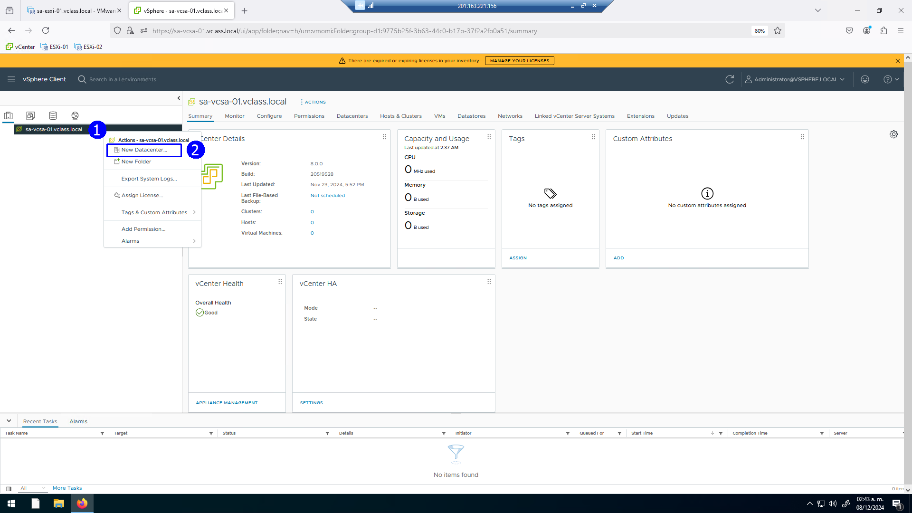

Dar nombre de **Production** (1) al datacenter y avanzar con click en
**OK** (2)

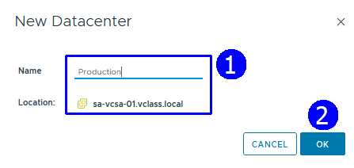

Se despliega el nuevo datacenter **Production**

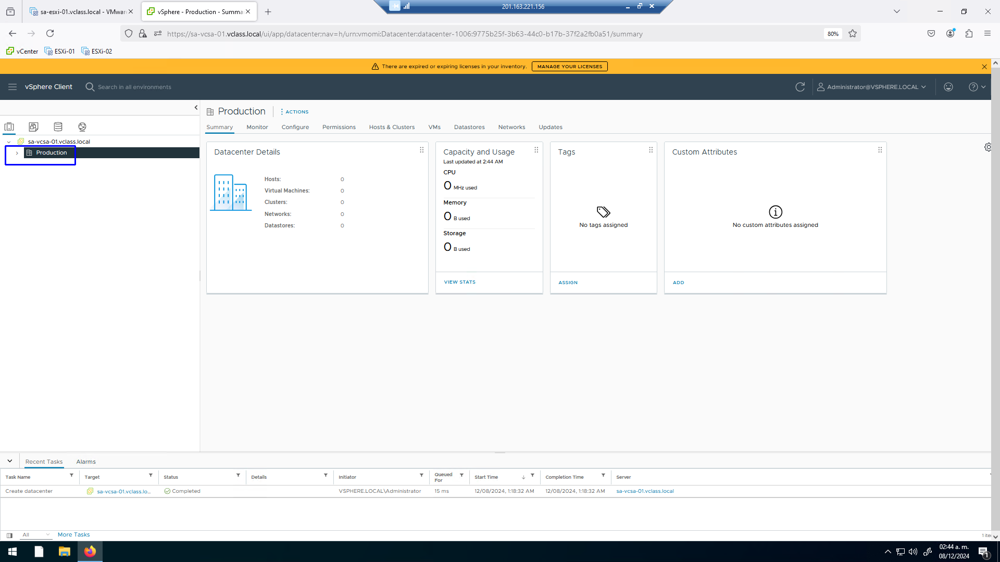

Aparecerá en el inventario el datacenter **Production** iniciando el
inventario de objetos de nuestro ambiente virtual

**  
**

## Actividad \# 2

**Creación de un folder para host ESXi**

En nuestro inventario en la vista de **Host and clusters** seleccionar
nuestro **datacenter Production** (1), dar click derecho para
seleccionar del menú contextual la opción: **New Folder** (2), click en:
**New Host and Cluster Folder** (3).

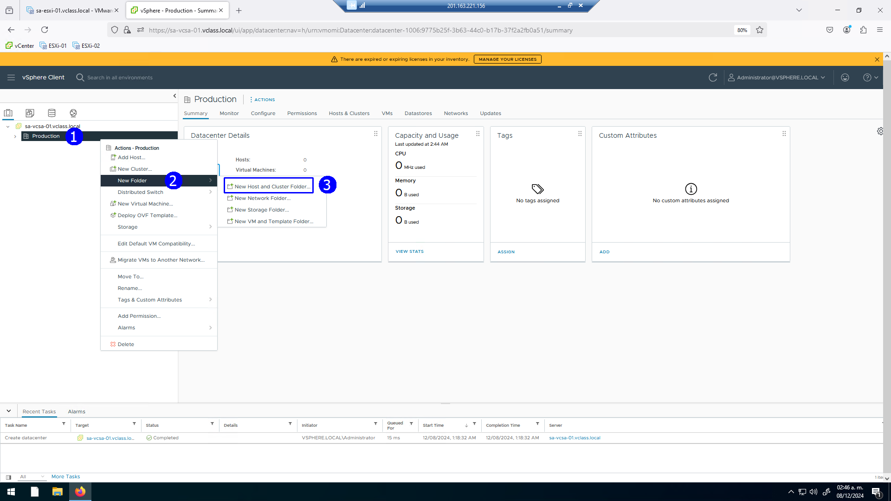

Se despliega una caja de diálogo, establecer el nombre de folder como
**Production Servers** (1), aceptar (2).

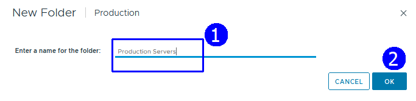

**  
**

Observar el folder (2) que se presenta en la vista de **Hosts &
Clusters** bajo el datacenter **Production** (1) , ahí alojaremos
nuestros hosts **ESXi**.

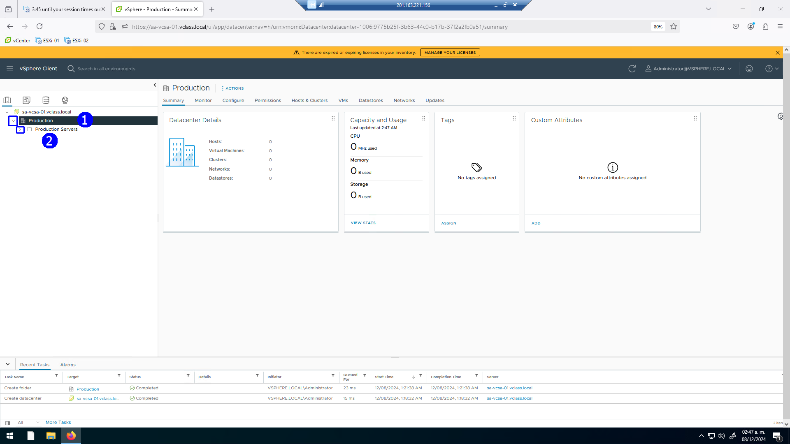

**  
**

## Actividad \# 3

**Creación de un folder para máquinas virtuales**

Crear un folder para nuestras VMs, seleccionar el datacenter
**Production** (1), con click derecho desplegar el menú contextual,
seleccionar: **New Folder** (2), click en **New VM and Template Folder**
(3)

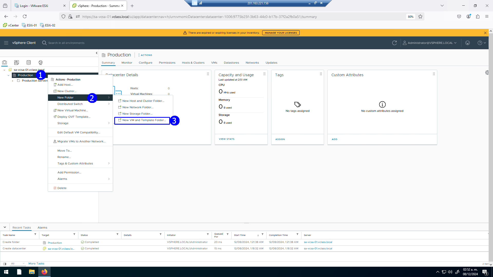

Establecer en la caja de diálogo el nombre de **Production VMs &
Templates** para el folder en el que se concentrarán las **VMs** de
nuestros **Hosts ESXi** (1).

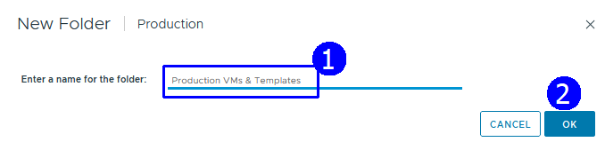

**  
**

Para ver el folder recientemente creado, seleccionar la vista de
máquinas virtuales y plantillas (1).  
Se despliega el **vCenter server** (2), el Datacenter **Production**
(3), y el folder creado **Production VMs & Templates** (4)

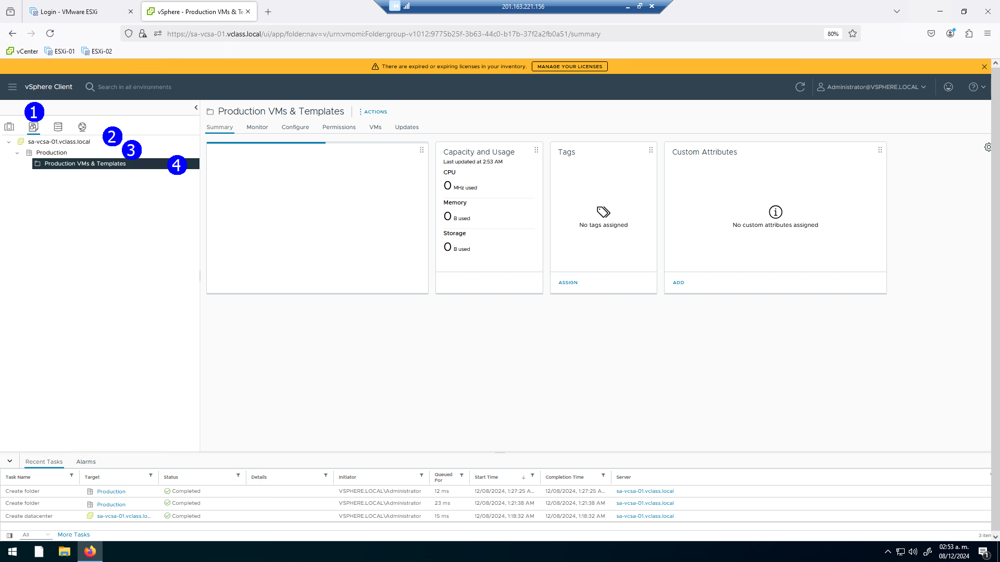

Hemos decido cambiar el nombre del datacenter, seleccionar el datacenter
**Production** (1), con click derecho mostrar el menú de contexto. Click
en: **Rename** (2)

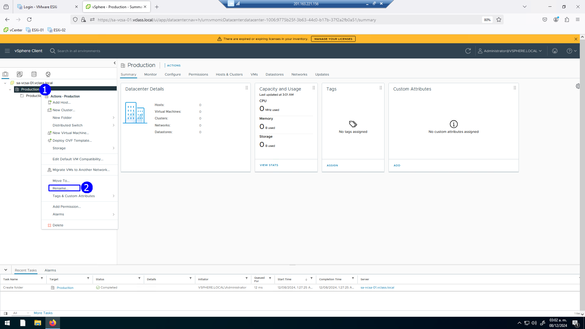

Introducir el nuevo nombre **Production Datacenter** (1) en el campo
correspondiente, aceptar (2)

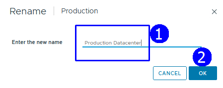

Se actualiza nuestro inventario con el nuevo nombre de **Production
Datacenter**

