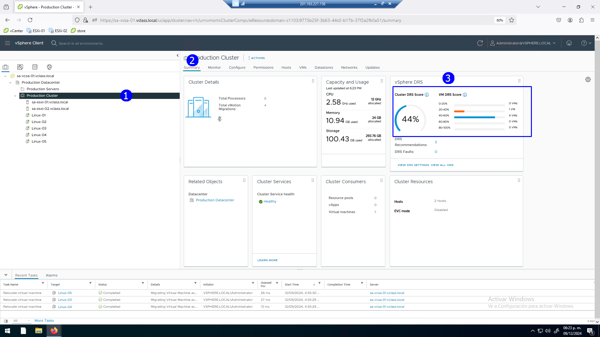

# Práctica 20. Balanceo de carga en el cluster con DRS

## Objetivos de la práctica:

- Crear un cluster.
- Establecer condiciones funcionales con DRS.
- Integrar Hosts al cluster.
- Activar el DRS en el cluster, Operación manual de DRS.
- Operación automática de DRS.

## Duración aproximada:
- minutos.
 

> Revisión 1.1 2024

## Instrucciones

### Actividad 1. Creación de un Cluster

Utilizar en su sistema la herramienta de “**Conexión a escritorio
remoto**” con la dirección y puerto que le proporcionará su instructor;
utilizar como:

> Usuario: `vclass\Administrator`
>
> Contraseña: `VMware1!`

Abrir una instancia de Firefox, seleccionar el acceso rápido de
**vCenter Server**.

Para configurar y aprovechar los servicios distribuidos, habrá que crear
un cluster.

Seleccionar el datacenter **Production Datacenter** (2).En el menú
contextual, seleccionar la opción **New Cluster** (3).

 

Proporcionar el nombre al cluster como **Production Cluster** (2). No
activar ningún servicio.

Desactivar la opción **Manage all host in the cluster with a single
image** (4), **Next** (5).

En este recuadro se pueden activar todos los servicios de inicio.

 

Revisar la configuración del cluster, **Finish** (3).

 
 

### Actividad 2. Establecer condiciones funcionales para DRS

DRS depende para su operación del servicio de classic vMotion.

Revisar en cada host que tengamos el puerto VMkernel con el servicio
vMotion activo.

Verificar en el host **ESXi_01**, en la opción de **Vmkernel adapters**
(5), puerto **vmk2** (6).

 

Verificar configuración similar en el host **ESXi_02**.

 
 

### Actividad 3. Integración de Hosts al cluster

Integrar los servidores al cluster.

Arrastrar con el mouse el Host **Esxi_01** sobre el cluster **Production
Cluster**.

Arrastar con el mouse el Host **ESXi_02** sobre el cluster **Production
Cluster**.

 

Observar que el cluster despliega los host y máquinas virtuales a la
misma altura sin mostrar jerarquía entre ellos.

Para ver que VMs están en cada Host, seleccionar un host y la pestaña de
**VMs**.

 
 

### Tarea 4. Activación de DRS en el cluster, Operación manual de DRS

Activar el servicio distribuido de DRS, en la vista de **Hosts &
Clusters** (1). Seleccionar el cluster **Production Cluster** (2), click
en la pestaña **Configure** (3), click en **vSphere DRS** (4), click en
**EDIT** (5).

Asegurarse que las VMs estén apagadas para una mejor ilustración del
servicio.

 

Activar el botón **vSphere DRS** (1). En **Automation Level**, del menú
desplegable, seleccionar **Manual** (2), deslizar la barra de **Migration
Threshold** al extremo derecho (muy agresivo) (3).

 

Se muestra la configuración deseada. Dejar otras opciones en su valor
por default, **OK** (4).

 

Se despliega la configuración deseada de DRS en modo manual.

Así vCenter no realiza movimiento de máquinas virtuales, solo presentará
sugerencias bajo demanda al verificar si existe un desbalanceo de
utilización de recursos en el cluster.

 

Encender la VM **Linux_01** (5).

En este caso, DRS realizará una recomendación para ubicar la VM en un
host específico.

 

En esta situación DRS recomienda ubicar la **Linux-01** en el host
**ESXi_01**(1), **OK** (2) dado que todas las VMs están apagadas

 

Al encender la máquina **Linux_02** propone encenderla en el host
**ESXi_01** (1), todavía **OK** (2).

 

Si encendemos una **Linux_03**, cambiará la propuesta. Por default
propone ubicarla en el host **ESXi_02** (1) para repartir la carga.

Nos da la opción de encenderla también en el host **ESXi_01** bajo
nuestra instrucción.

Aceptar la opción propuesta host **ESXi_02**, **OK** (2).

 

Al encender la VM **Linux_04** se presenta una situación similar (1).

Seleccionar la opción por default de **ESXi_02**, **OK** (2).

 

Al activar la **Linux_05** cambia la propuesta sobre el host
**ESXi_01**, (1).

Claramente, sin tener referencia de las aplicaciones que consumirán
recursos trata de alternar las propuestas de ubicación en las máquinas al
encender **OK** (2).

 

Para identificar en que host se han ubicado las VMs que se han encendido.

Con un host **ESXi_01** (1) seleccionado, click en la pestaña **VMs**
(2). Tenemos dos VMs encendidas (3). Notar la VM de servicios que se ha
creado también y se ha ubicado en este host **ESXi_01**, el nombre de la
misma inicia con **vCLS** (4)

 

Algo similar se puede observar al seleccionar el Host **ESXi_02**, dos
**VMS** (3) encendidas.

También se crea en este servidor otra VM de servicios (4).

 

Seleccionar el cluster **Production Cluster**.

En la pestaña de Summary se presenta la estadística de calificación de
DRS con un buen score de 99%.

 

Modifiquemos el escenario al acceder a la consola de la **VM Linux 01**.

Activar la aplicación de CPU Busy.

En la aplicación **Terminal,** emitir los comandos:

`ls`

`Cd Desktop`

`ls`

`Chmod +x cpubusy.pl`

`Perl ./cpubusy.pl`

 

Realizar la misma tarea en la **Linux_02** que está en el mismo host
**ESXi_01** que la **Linux_01**.

 

Retornar a la información de resumen de DRS, observar que la
calificación de DRS ahora ha bajado a 96%.

 

Ver que propone **DRS**.

Click en la sección de DRS en la opción **Recommendations**.

Observar la recomendación de **DRS**, migrar la **Linux_05 de ESXi_01 al
ESXi_02** (2).

Aplicar la recomendación **APPLY RECOMMENDATIONS** (3).

 

Se ha migrado la **Linux 05** al host **ESXi_02**.

 

El host **ESXi_01** se ha quedado con sólo dos VMs.

 

Terminar la aplicación en ambas máquinas virtuales.

 

Ahora, seleccionar las VMs (salvo la de servicios) en el **Host ESXi_02**
(2) y (3).

 

Con el botón de contexto, seleccionar la opción de **Migrate** (1).

Se solicita la confirmación de migración de varias VMs a un mismo
tiempo, aceptar **(Yes)** (1).

 

Seleccionamos la opción.

**Change compute resource only** (2), **Next** (3).

 

Seleccionamos el host destino

Pretendemos tener todas las VMs trabajando en un sólo host **ESXi_01**
(2), **Next** (3).

 

Seleccionar la misma red destino (2), **Next** (3).

 

Seleccionar la opción **Schedule vMotion with high priority
(recommended)** (2), **Next** (3).

 

Revisar la información de migración, **Finish** (3).

 

Observar el inicio de tareas de vMotion múltiple.

 

Ahora todas las VMs están en el host **ESXi_01** (3).

 

La calificación de DRS se ha desplomado a 44% (3).

 
 

### Actividad 3. Operación automática de DRS

Reconfigurar DRS.
Seleccionar el cluster **Production Cluster** (2), click en la pestaña
**Configure** (3), click en opción **vSphere DRS** (4), click en
**EDIT** (5).

 

Activar DRS en modo totalmente automático. Dejar el nivel de migración 
totalmente agresivo.

 

Observar cómo se migran automáticamente las VMS, en la ilustración se
muestra el host **ESXi_02** sin VMs (4).

 

Minutos después, se integran al host 3 VMs bajo una migración automática.

 

Ahora en el cluster DRS periódicamente balanceará la carga, ofreciendo
un mejor desempeño en general
