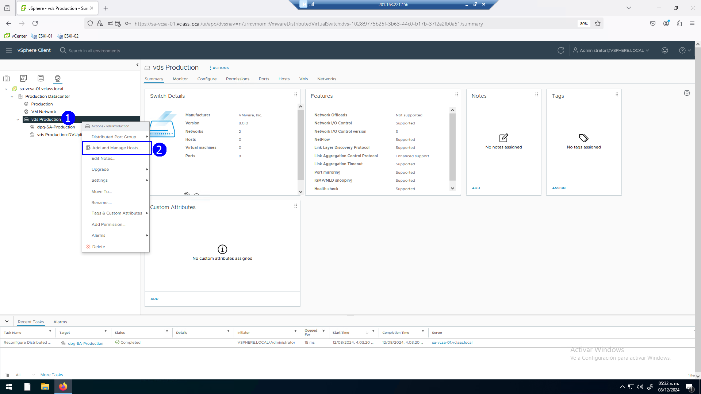
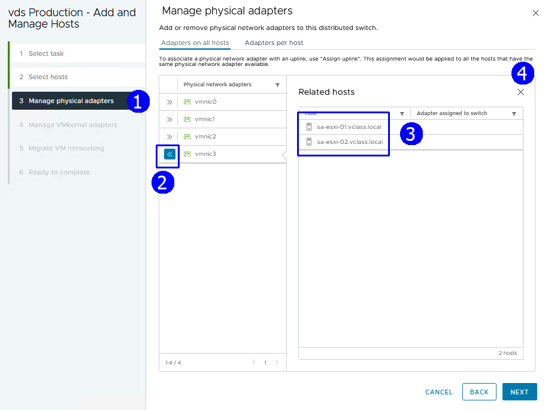
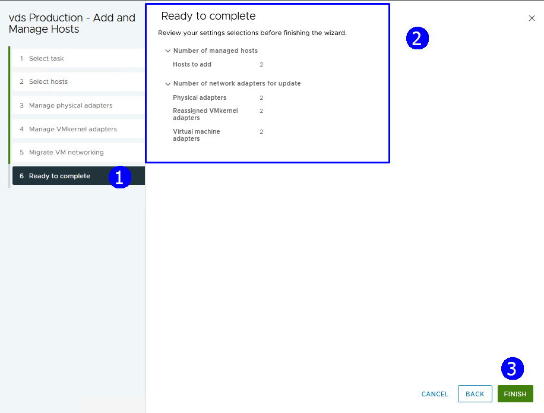

# Práctica 5. Configuración de switches distribuidos

## Objetivos de la práctica:

- Crear un Switch distribuido.
- Configuración del Switch distribuido.
- Integración de Hosts al Switch distribuido, migración de **VMs**.
- Verificar configuración del Switch distribuido.

## Duración aproximada:
- 20 minutos.
 

> Revisión 1.1 2024

## Instrucciones

### Actividad 1. Crear y configurar un Switch distribuido

Utilizar en su sistema la herramienta de “**Conexión a escritorio
remoto**” con la dirección y puerto que le proporcionará su instructor;
utilizar como:

> Usuario: `vclass\Administrator`
>
> Contraseña: `VMware1!`

Abrir una instancia de Firefox. Seleccionar el acceso rápido de
**vCenter**.

Para crear un Switch distribuido, click en la vista de redes (1). Dar click
en el **datacenter Production Datacenter** (2), presionar el botón
derecho, en el menú contextual seleccionar **Distributed Switch**, click
en **New Distributed Switch** (4).

 

En el paso de Nombre y ubicación establecer como nombre: **vds
Production** (2), aceptar (3).

 

En el paso para seleccionar la versión de Switch, dejar la versión por
default **Esxi 8.0** (2), aceptar (3).

 

En el paso de configuración de especificaciones, dejar los campos con
opciones de **default** y asignar el nombre **dps-SA-Production** al
**port group** (2), aceptar (3).

 

Revisar la configuración del Switch, aceptar (3).

 
 

### Actividad 2. Configuración del Switch distribuido

En la vista de redes, seleccionar el **Production Datacenter** y
expandir el switch **vds Production**.

Observar el port group **dps-SA-Production**.

 

Click en el port group **dpg-SA-Production** (1), presionar el botón
derecho y seleccionar **Edit Settings** (2).

 

Se muestra la caja de diálogo siguiente:

 

Seleccionar un **Uplink** a la vez y mover hacia abajo a la sección de
**Standby uplinks** con el botón **MOVE DOWN** para terminar con la
configuración siguiente. Sólo el **uplink 3** (3) queda activo, los
otros están inactivos (4), aceptar las opciones de **monitoring y
micellaneous** con valores de default.

 
 

### Actividad 3. Integración de Hosts al Switch distribuido, migración de VMs

Para administrar los hosts en la vista de red, seleccionar el Switch
distribuido (1), presionar botón derecho, click en **Add and Manage
Host** (2).

 

En la opción de seleccionar tareas, click en **Add Host** (2), aceptar
(3).

 

En el paso para seleccionar host, click en **SELECT ALL** (2), aceptar
(3).

 

En el paso de administrar tarjetas de red físicas, seleccionar la
**vmnic 3** que dejamos como activas en ambos **ESXis**. Se ve la lista
de **Related Host** (3) incluyendo al **ESXi-01** y **ESXi-02**.

 

Seleccionar **uplink 3** (1) de la lista desplegable.

 

El resultado es el siguiente, aceptar (4).

 

En el paso de administración de adaptadores **VMkernel**, click en
**Assign port group** (2) y seleccionar el port group **dpg
SA-Production** (5).

Click en **ASSIGN** (4), Next (5).

 

El resultado es el siguiente:

 

En el paso de migrar **VMs**, click en **Migrate virtual machine
networking** (2). Dar click en **configure per network adapter** (3), click
en **ASSIGN PORT GROUP** (5).

 

Revisar la configuración, aceptar (3).

 
 

### Actividad 4. Verificar configuración del Switch distribuido

Para explorar la configuración final, click en el Switch distribuido (1).
Dar click en la pestaña **Configure** (2), en la sección de **Settings**
(3), click en **Topology** (4). Observar las **VMS** (6) y las **vmnics**
asociadas de cada Host (5).

 

Otra vista de la configuración está al seleccionar el **Switch** (1).
Dar click en la pestaña **Configure** (2), en la sección de **Settings**,
click en **Properties** (3). Verificar **Uplinks** (4), **MTU** (5),
**CDP** (6).

 

Seguir inspeccionando, click en el port group (1), click en **Configure**
(2) en la sección de **Settings**. Dar click en **properties** (4), observar
**port binding y port Allocation** (5).

 

Para revisar que las **VMs** están controladas por el **Switch**, dar click
en el **port Group** (1), click en la pestaña **VMs** (2). Ver la lista
de **VMs** (3).

 

Dar click en el port group (1). Click en pestaña **Ports** (2), se muestra
lista de hosts asociados (3), **VMs** (4) y estado de uplinks (5).

