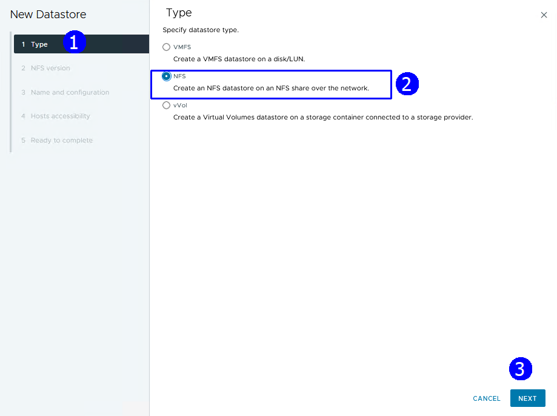
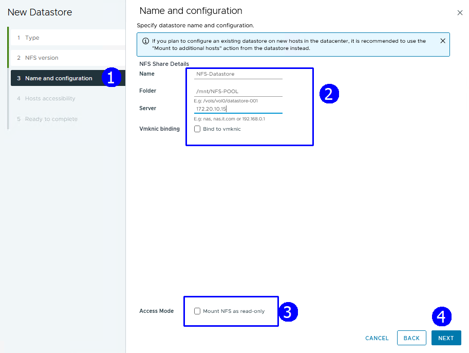
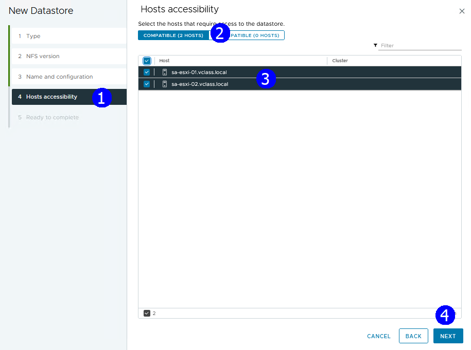
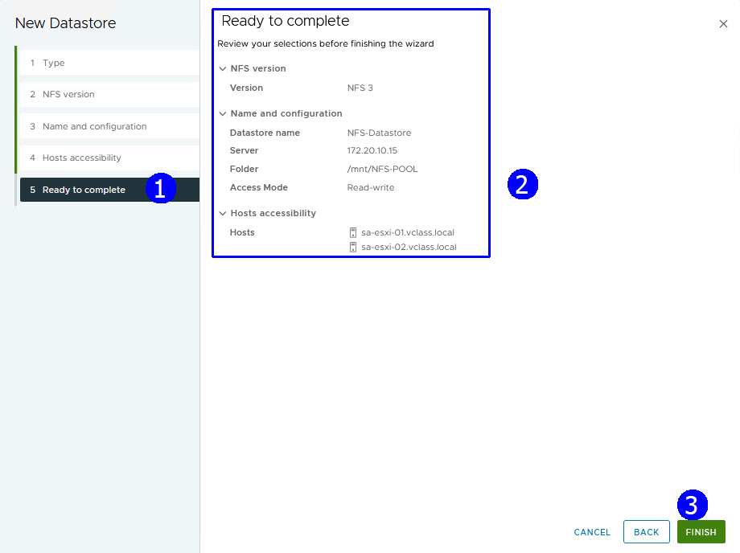
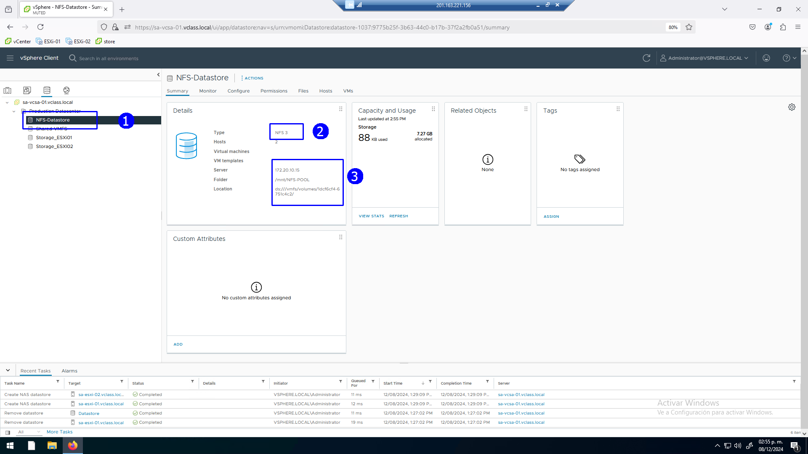

# Práctica 8. DataStores NFS

## Objetivos de la práctica:
- Crear un datastore NFS.

## Duración aproximada:
- minutos.
 

> Revisión 1.1 2024

## Instrucciones

### Actividad 1. Creación de un dataStore NFS

Utilizar de su sistema la herramienta de “**Conexión a escritorio
remoto**” con la dirección y puerto que le proporcionará su instructor;
utilizar como:

> Usuario: `vclass\Administrator`
>
> Contraseña: `VMware1!`

Abrir una instancia de Firefox, seleccionar el acceso rápido de
**vCenter**.

Para contar con un DataStore NFS, en la vista de DataStores (1), click
en el Datacenter **Production Datacenter** (2). En el menú contextual
seleccionar **Storage** (3) click en **New Datastore** (4).

En el paso de tipo de DataStore, seleccionar NFS (2), Next (3).

Click en la versión NFS 3 (2), Next (3).

Establecer en nombre de DataStore como **NFS-Datastore**, Folder
**/mnt/NFS-POOL**, Server **172.20.10.15** (2). Asegurar que está sin
activar **Mount NFS as ready-only** (3), **Next** (4).

Establecer que el DataStore NFS será visible para ambos host ESXi, click
en **host** (3), **Next** (4).

Revisar resumen de la configuración, FINISH (3).

Se presenta en la lista de DataStores en el servicio de almacenamiento NFS
**NFS-Datastore**, visible desde los dos hosts ESXi.

